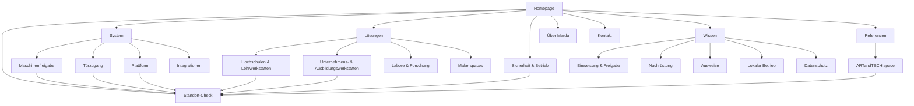

# Mardu Informationsarchitektur

**Stand:** 1. August 2026<br>
**Seitentyp:** hybride B2B-Produkt- und Wissenswebsite<br>
**Ziel:** verständliche Käuferreise mit wenigen, belastbaren Kernseiten

## 1. Grundprinzip

Die Seitenstruktur folgt Käuferfragen, nicht internen Produktnamen:

1. Was löst Mardu?
2. Wie funktioniert die Freigabe?
3. Passt das zu meinem Werkstatttyp?
4. Welche Rolle spielt Mardu im Sicherheits- und Betriebskonzept?
5. Wie wird integriert und installiert?
6. Welche Belege gibt es?
7. Wie starte ich ein Projekt?

Wichtige Seiten sind in höchstens drei Klicks erreichbar.

## 2. Kanonischer Seitenbaum

```text
Homepage (/)
├── System (/system)
│   ├── Maschinenfreigabe (/system/maschinenfreigabe)
│   ├── Türzugang (/system/tuerzugang)
│   ├── Plattform (/system/plattform)
│   └── Integrationen (/system/integrationen)
├── Lösungen (/loesungen)
│   ├── Hochschulen & Lehrwerkstätten (/loesungen/hochschulen-lehrwerkstaetten)
│   ├── Unternehmens- & Ausbildungswerkstätten (/loesungen/unternehmens-ausbildungswerkstaetten)
│   ├── Labore & Forschung (/loesungen/labore-forschung)
│   └── Makerspaces & offene Werkstätten (/loesungen/makerspaces-offene-werkstaetten)
├── Sicherheit & Betrieb (/sicherheit-betrieb)
├── Referenzen (/referenzen)
│   └── ARTandTECH.space (/referenzen/artandtech-space)
├── Wissen (/wissen)
│   ├── Einweisung und Maschinenfreigabe (/wissen/einweisung-maschinenfreigabe)
│   ├── Bestandsmaschinen nachrüsten (/wissen/bestandsmaschinen-nachruesten)
│   ├── Vorhandene Ausweise integrieren (/wissen/ausweise-integrieren)
│   ├── Lokaler Betrieb (/wissen/lokaler-betrieb)
│   └── Datenschutz bei Nutzungsdaten (/wissen/datenschutz-nutzungsdaten)
├── Über Mardu (/ueber-mardu)
├── Standort-Check (/standort-check)
├── Kontakt (/kontakt)
└── Rechtliches
    ├── Impressum (/impressum)
    └── Datenschutz (/datenschutz)
```

## 3. Visuelle Sitemap



## 4. Header-Navigation

Reihenfolge:

1. System
2. Lösungen
3. Sicherheit & Betrieb
4. Referenzen
5. Wissen
6. **Standort besprechen** als primärer CTA

### Verhalten

- Logo verlinkt auf `/`.
- Maximal fünf reguläre Navigationseinträge plus CTA.
- System und Lösungen dürfen kompakte Dropdowns erhalten.
- Dropdowns zeigen höchstens zwei Ebenen und keine Marketingtexte in Romanlänge.
- Mobile Navigation ist vollständig per Tastatur bedienbar.
- Aktive Seite wird visuell und semantisch gekennzeichnet.

## 5. Footer-Navigation

### System

- Maschinenfreigabe
- Türzugang
- Plattform
- Integrationen

### Lösungen

- Hochschulen & Lehrwerkstätten
- Unternehmens- & Ausbildungswerkstätten
- Labore & Forschung
- Makerspaces

### Vertrauen und Wissen

- Sicherheit & Betrieb
- Referenzen
- Wissen
- technische Unterlagen, falls vorhanden

### Unternehmen

- Über Mardu
- Kontakt
- Standort-Check

### Rechtliches

- Impressum
- Datenschutz

## 6. URL-Map

| Seite                | URL                                               | Parent     | Navigation      | Priorität |
| -------------------- | ------------------------------------------------- | ---------- | --------------- | --------- |
| Homepage             | `/`                                               | –          | Logo            | sehr hoch |
| System               | `/system`                                         | Homepage   | Header          | sehr hoch |
| Maschinenfreigabe    | `/system/maschinenfreigabe`                       | System     | Dropdown        | sehr hoch |
| Türzugang            | `/system/tuerzugang`                              | System     | Dropdown        | hoch      |
| Plattform            | `/system/plattform`                               | System     | Dropdown        | hoch      |
| Integrationen        | `/system/integrationen`                           | System     | Dropdown/Footer | mittel    |
| Lösungen             | `/loesungen`                                      | Homepage   | Header          | hoch      |
| Hochschulen          | `/loesungen/hochschulen-lehrwerkstaetten`         | Lösungen   | Dropdown        | sehr hoch |
| Unternehmen          | `/loesungen/unternehmens-ausbildungswerkstaetten` | Lösungen   | Dropdown        | hoch      |
| Labore               | `/loesungen/labore-forschung`                     | Lösungen   | Dropdown        | mittel    |
| Makerspaces          | `/loesungen/makerspaces-offene-werkstaetten`      | Lösungen   | Dropdown/Footer | mittel    |
| Sicherheit & Betrieb | `/sicherheit-betrieb`                             | Homepage   | Header          | sehr hoch |
| Referenzen           | `/referenzen`                                     | Homepage   | Header          | hoch      |
| Referenzdetail       | `/referenzen/{slug}`                              | Referenzen | kontextuell     | hoch      |
| Wissen               | `/wissen`                                         | Homepage   | Header          | mittel    |
| Wissensbeitrag       | `/wissen/{slug}`                                  | Wissen     | kontextuell     | mittel    |
| Über Mardu           | `/ueber-mardu`                                    | Homepage   | Footer          | mittel    |
| Standort-Check       | `/standort-check`                                 | Homepage   | CTA             | sehr hoch |
| Kontakt              | `/kontakt`                                        | Homepage   | Footer          | hoch      |

## 7. Redirect-Plan

| Bestehende Route    | Neues Ziel                               | Hinweis                                        |
| ------------------- | ---------------------------------------- | ---------------------------------------------- |
| `/products`         | `/system`                                | Katalog in zusammenhängendes System überführen |
| `/products/[slug]`  | passender Systempfad                     | pro Slug bewusst mappen                        |
| `/platform`         | `/system/plattform`                      | deutscher kanonischer Pfad                     |
| `/solutions`        | `/loesungen`                             | Sprache vereinheitlichen                       |
| `/solutions/[slug]` | passende neue Lösungsseite               | nur bestätigte Segmente veröffentlichen        |
| `/integrations`     | `/system/integrationen`                  | Integration als Systemebene                    |
| `/roadmap`          | `/system#leistungsstatus` oder entfernen | keine öffentliche Produktzusage                |
| `/configurator`     | `/standort-check`                        | beratungsintensiven Prozess abbilden           |
| `/pricing`          | vorerst kein öffentliches Ziel           | erst nach verbindlicher Preiswahrheit          |
| `/about`            | `/ueber-mardu`                           | gebrochenen Link ersetzen                      |
| `/contact`          | `/kontakt`                               | Sprache vereinheitlichen                       |
| `/whitepaper`       | thematisch passende Wissensseite         | nur bei funktionierendem Downloadflow          |

Vor Umsetzung werden reale Indexierung, Backlinks und bestehender Traffic geprüft. Jede entfernte öffentliche URL erhält einen bewussten 301-Redirect oder einen dokumentierten Grund für 410.

## 8. Breadcrumbs

Breadcrumbs spiegeln die URL-Hierarchie:

```text
Startseite > System > Maschinenfreigabe
Startseite > Lösungen > Hochschulen & Lehrwerkstätten
Startseite > Wissen > Bestandsmaschinen nachrüsten
```

Alle Segmente außer der aktuellen Seite sind verlinkt.

## 9. Interne Verlinkung

### Lösungsseiten

Verlinken:

- relevante Systemmodule,
- Sicherheit & Betrieb,
- passende Referenz,
- Standort-Check.

### Systemseiten

Verlinken:

- passende Zielgruppen,
- Integrationen,
- Betriebsgrenzen,
- Standort-Check.

### Wissensseiten

Verlinken:

- übergeordnetes Themenhub,
- eine relevante System- oder Lösungsseite,
- zwei verwandte Beiträge,
- genau einen nächsten Schritt.

### Referenzen

Verlinken:

- konkret verwendete Systemteile,
- betroffene Zielgruppe,
- technische beziehungsweise organisatorische Grenzen,
- ähnlichen Standort besprechen.

## 10. Startumfang

Ein belastbarer erster Launch benötigt nur:

1. Homepage,
2. System,
3. Maschinenfreigabe,
4. Hochschulen & Lehrwerkstätten,
5. Sicherheit & Betrieb,
6. Referenz/Herkunft,
7. Standort-Check und Kontakt,
8. Rechtliches.

Weitere Seiten folgen, wenn Inhalte, Belege und technischer Umfang vorhanden sind. Seitenmenge ist kein Qualitätsmerkmal.

## 11. Architekturprüfung

- Jede wichtige Seite ist in höchstens drei Klicks erreichbar.
- Keine Seite ist verwaist.
- Header enthält höchstens fünf reguläre Einträge plus CTA.
- URL und Breadcrumb stimmen überein.
- Alte URLs besitzen dokumentierte Redirects.
- Jede Lösungsseite führt zu System, Vertrauen, Referenz und CTA.
- Jede Wissensseite hat ein Hub und einen produktsinnvollen nächsten Schritt.
- Sitemap und Navigation werden aus derselben kanonischen Routenliste abgeleitet oder gemeinsam gepflegt.
