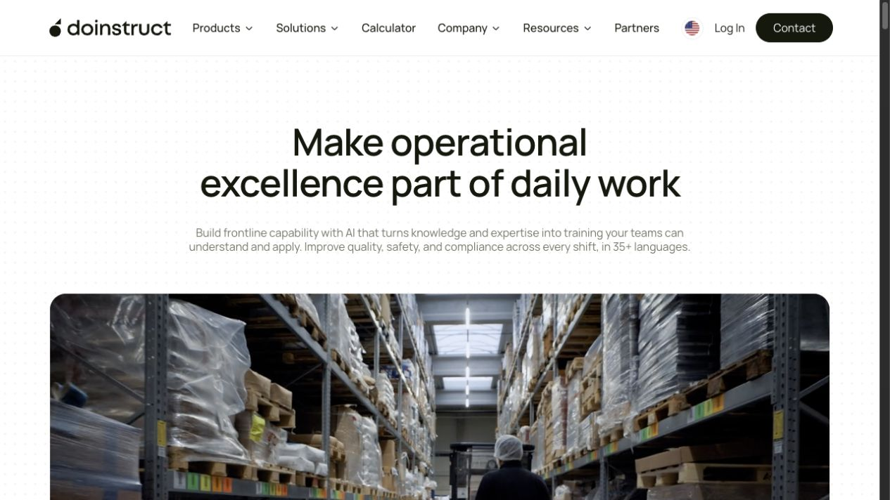
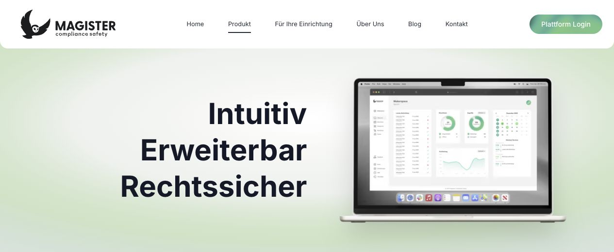
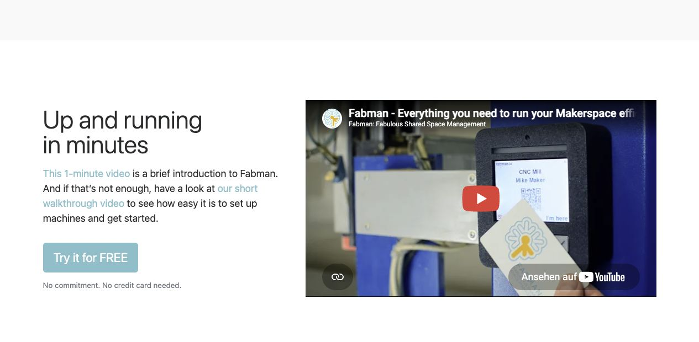
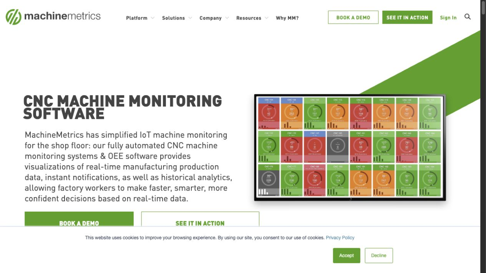
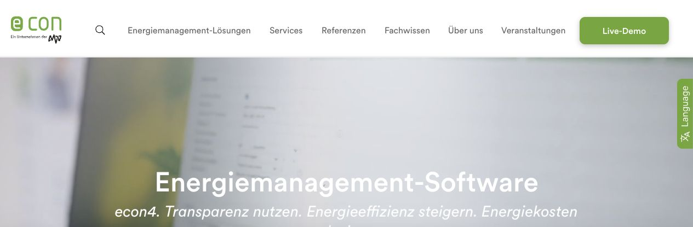

# Mardu Visuelle Referenzen

**Stand:** 1. August 2026 
**Status:** interne Referenzsammlung für Design, Inhalte und Reviews 
**Geltungsbereich:** öffentlich zugängliche Websites ähnlicher oder angrenzender Anbieter

## 1. Zweck und Nutzungsrahmen

Diese Sammlung hält nicht fest, wie Mardu aussehen soll. Sie zeigt einzelne Kommunikations- und Seitenmuster, die eine konkrete Aufgabe gut lösen. Jede Referenz wird deshalb mit einer Mardu-Ableitung und einer Abgrenzung dokumentiert.

Die Screenshots wurden am 1. August 2026 von öffentlich zugänglichen Seiten aufgenommen. Marken, Texte, Bilder und Gestaltung bleiben Eigentum der jeweiligen Rechteinhaber. Die Dateien dienen ausschließlich der internen Designanalyse. Sie dürfen weder als Mardu-eigene Gestaltung noch als Kunden-, Partner- oder Produktbeleg veröffentlicht werden.

## 2. Auswahlmatrix

| Referenz       | Relevante Frage                                    | Für Mardu übernehmen                                   | Bewusst nicht übernehmen                                       |
| -------------- | -------------------------------------------------- | ------------------------------------------------------ | -------------------------------------------------------------- |
| Doinstruct     | Wie führt ein Hero mit betrieblicher Wirkung?      | Wirkung vor Mechanismus, klare Hierarchie              | Wortlaut, Bildwelt und fremde Vertrauenszahlen                 |
| Magister       | Wie wird die Kategorie früh sichtbar?              | Produktoberfläche und Systembezug im ersten Blick      | pauschale Rechts- oder Sicherheitsversprechen                  |
| Fabman         | Wie werden Hardware und Einstieg greifbar?         | reale Hardware, kurzer Ablauf, klarer nächster Schritt | unbelegte Plug-and-play- oder Zeitversprechen                  |
| Augury         | Wie wird ein Betriebsnutzen sprachlich verdichtet? | aktive Nutzenverben und kurze Erklärung                | AI-Überhöhung, Dramatisierung und Konzernmaßstab als Mardu-Ton |
| MachineMetrics | Wie wird Maschinendaten-UI verständlich gezeigt?   | große, fokussierte Produktansicht                      | dekorative Kennzahlen ohne Messgrundlage                       |
| econ4          | Wie werden Energiedaten als Nutzen erzählt?        | Transparenz, Effizienz und Kosten als Ergebniskette    | Darstellung als fertige Mardu-Standardleistung                 |

## 3. Doinstruct – Wirkung vor Produktmechanik

**Quelle:** [doinstruct.com](https://www.doinstruct.com/)

### Was funktioniert

- Die Headline beschreibt eine Veränderung im Arbeitsalltag.
- Die Subline verbindet Wissen, Training, Qualität, Sicherheit und Compliance, ohne den Hero mit Features zu überladen.
- Eine reale Szene macht den Nutzungskontext sofort sichtbar.
- Navigation und Hauptaktion bleiben trotz großem Visual klar.

### Mardu-Ableitung

Der Mardu-Hero beginnt ebenfalls mit der betrieblichen Wirkung. Darunter folgt eine kurze Erklärung der Freigabelogik. Das Visual zeigt einen echten Mardu-Ablauf aus Person, Identmedium, Maschine und sichtbarem Ergebnis. Vertrauenszahlen werden nur mit Quelle und Methodik verwendet.

### Nicht kopieren

Die industrielle Bildwelt darf nicht als austauschbares Stockmotiv übernommen werden. Mardu braucht echte Werkstätten und muss sich sprachlich von einer Trainingsplattform unterscheiden.

## 4. Magister – direkte Kategorie- und Abgrenzungsreferenz

**Quelle:** [Magister Produkt](https://magister-compliance.de/produkt)

### Was funktioniert

- Drei kurze Eigenschaften schaffen eine sofortige Orientierung.
- Die Produktoberfläche wird prominent gezeigt.
- Der Plattformzugang macht sichtbar, dass hinter der Marketingseite ein digitales System steht.
- Maschinenfreigabe, Unterweisung und Dokumentation werden als zusammenhängende Kategorie erklärt.

### Mardu-Ableitung

Mardu zeigt das reale Zusammenspiel aus Maschinenanbindung, Zugang und Plattform ebenfalls früh. Die Differenzierung entsteht über kontrollierte Ermöglichung, Nachrüstprüfung, Integrationsfähigkeit und beweisorientierte Kommunikation.

### Nicht kopieren

„Rechtssicher“ wird nicht als pauschaler Mardu-Claim eingesetzt. Rechtliche, organisatorische und sicherheitstechnische Grenzen werden konkret benannt. Auch die grüne Farbwelt ist keine Mardu-Vorlage.

## 5. Fabman – Hardware und Einstieg in einem Modul

**Quelle:** [fabman.io](https://fabman.io/)

### Was funktioniert

- Reale Hardware wird im tatsächlichen Einsatz gezeigt.
- Video, Erklärung und CTA beantworten gemeinsam die Frage „Wie beginnt das?“.
- Der Abschnitt reduziert die wahrgenommene Komplexität, ohne die Hardware zu verstecken.

### Mardu-Ableitung

Für Maschinenfreigabe und Türzugang entsteht je ein ähnlicher Belegblock: reale Einbausituation, drei bis fünf fachliche Prüfschritte, erwartetes Ergebnis und CTA „Maschine prüfen lassen“ beziehungsweise „Standort besprechen“.

### Nicht kopieren

Mardu verspricht keine Inbetriebnahme „in Minuten“, solange Maschinentyp, elektrische Einbindung, Betreiberkonzept und Installation geprüft werden müssen.

## 6. Augury – Nutzen in aktive Sprache übersetzen

**Quelle:** [augury.com](https://www.augury.com/)

### Was funktioniert

- Kurze Verben erzeugen eine klare Handlungsrichtung.
- Die Erklärung darunter übersetzt Daten in eine betriebliche Entscheidung.
- Die rechte Stufung strukturiert mehrere Nutzen, ohne sofort eine Featuretabelle zu zeigen.

### Mardu-Ableitung

Die Nutzenbereiche können mit aktiven Verben arbeiten: „Steuern“, „Ermöglichen“, „Verstehen“. Jede Stufe erhält genau eine Erklärung und einen realen Beleg oder sichtbaren Reifegrad.

### Nicht kopieren

Mardu vermeidet einen heroischen AI-Ton. Die Sprache bleibt präzise, deutsch und auf reale Werkstattverantwortung zugeschnitten.

## 7. MachineMetrics – Datenoberfläche als Produktbeleg

**Quelle:** [MachineMetrics Machine Monitoring](https://www.machinemetrics.com/machine-monitoring)

### Was funktioniert

- Die Produktansicht ist groß und als Maschinenübersicht unmittelbar erkennbar.
- Der Text nennt Echtzeitdaten, Benachrichtigungen und historische Analyse als Entscheidungshilfe.
- Produktbeleg und Nutzenversprechen stehen nebeneinander.

### Mardu-Ableitung

Eine spätere Mardu-Datensektion zeigt nicht „Analytics“ im Allgemeinen. Sie beantwortet eine konkrete Frage, zum Beispiel: Welche Maschine wurde wann genutzt? Wie lange war sie aktiv? Wo weicht ein Verlauf von einer dokumentierten Vergleichsbasis ab? Jede Darstellung nennt Datenquelle, Zeitraum und Reifegrad.

### Nicht kopieren

Die farbige Dashboardmatrix ist keine Mardu-Ästhetik. Energie, Laufzeit und Anomalien dürfen erst als reale Produkt- oder Pilotansicht erscheinen, wenn Datenerfassung und Interpretation validiert sind.

## 8. econ4 – Energie vom Messwert zum Ergebnis erzählen

**Quelle:** [econ4 Energiemanagement-Software](https://www.econ-solutions.de/software/econ4)

### Was funktioniert

- Die Kategorie ist sofort verständlich.
- Transparenz, Energieeffizienz und Energiekosten bilden eine nachvollziehbare Wirkungskette.
- Ein konkreter Demo-Schritt ist sichtbar.

### Mardu-Ableitung

Wenn Energieerfassung validiert ist, erzählt Mardu die Kette enger: Nutzung erfassen → Verbrauch in Kontext setzen → Abweichung sichtbar machen → fachliche Prüfung unterstützen. Die Formulierung bleibt bewusst bei Transparenz und Unterstützung, nicht bei garantierter Einsparung.

### Nicht kopieren

Energie ist derzeit kein führender Hero-Claim und keine zugesagte Standardfunktion. Das Thema gehört bis zur Produkt- und Messvalidierung in Pilot- oder Zukunftskommunikation.

## 9. Gemeinsame Konsequenzen für den Mardu-Auftritt

1. Der erste Sichtbereich verbindet eine betriebliche Wirkung mit einem realen Produkt- oder Nutzungssignal.
2. Hardware wird nicht versteckt, sondern als Teil einer fachlich geprüften Einführung gezeigt.
3. Datenvisualisierungen beantworten eine konkrete Betreiberfrage und nennen Quelle, Zeitraum sowie Reifegrad.
4. Ein starker Claim erhält direkt daneben einen Nachweis, eine Voraussetzung oder eine klare Grenze.
5. Ein Screenshot ersetzt keinen Mardu-Beleg. Für die öffentliche Seite werden reale Mardu-Aufnahmen neu produziert.
6. Jede Referenz wird im Designreview auf Mardu-Ton, Glaubwürdigkeit, Accessibility und Abgrenzung geprüft.

## 10. Ablage und Pflege

Die Referenzbilder liegen in `assets/references/`. Neue Screenshots verwenden das Muster `<anbieter>-<muster>-YYYY-MM-DD.jpg` und erhalten in diesem Dokument:

- einen direkten Quellenlink,
- ein Aufnahmedatum,
- einen konkreten Analysezweck,
- eine Mardu-Ableitung,
- eine explizite Nicht-kopieren-Regel.

Veraltete Screenshots werden ersetzt, wenn sich das analysierte Muster wesentlich verändert. Die alte Datei wird nicht als Produktionsasset weiterverwendet.
