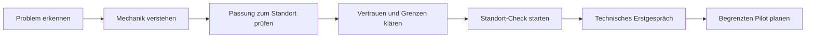

# Mardu.de – strategische Neukonzeption der Website

> **Hinweis vom 1. August 2026:** Dieses Dokument bleibt als ausführlicher Recherche- und Ideenbestand erhalten. Die verbindliche, kategorisch getrennte Arbeitsgrundlage liegt im [Mardu Website-Handbuch](./mardu-website-handbuch/README.md). Spätere Entscheidungen im Handbuch – insbesondere das neue Slogansystem – haben Vorrang.

**Stand:** 31. Juli 2026<br>
**Dokumenttyp:** Positionierung, Website-Architektur, Copy- und Designkonzept<br>
**Geltungsbereich:** neue `mardu.de` auf der vorhandenen technischen Basis, ohne Bindung an das bestehende visuelle Design<br>
**Nicht enthalten:** verbindliche Produkt-Roadmap, Rechtsberatung, Zertifizierungszusage oder bereits beschlossene Implementierung

---

## 1. Kurzfassung

Mardu sollte auf der neuen Website nicht primär als Sammlung aus Türcontroller, Maschinencontroller und Software erscheinen. Das eigentliche Produktversprechen ist stärker:

> **Mardu übersetzt organisatorische Regeln in technische Freigaben.**

Wer eingewiesen, berechtigt und im richtigen Zeitfenster ist, kann die passende Tür öffnen oder Maschine starten. Betreiber führen Zugang, Qualifikationen und Freigaben in einem System zusammen und können Vorgänge nachvollziehen.

Die empfohlene Kommunikationslogik lautet:

1. **Steuern:** Nur berechtigte und eingewiesene Personen erhalten die vorgesehene Freigabe.
2. **Ermöglichen:** Weniger manuelles Aufschließen und Freigeben kann mehr nutzbare Werkstattzeit ermöglichen – soweit das Betriebs-, Aufsichts- und Sicherheitskonzept des Betreibers dies erlaubt.
3. **Verstehen:** Nutzungs-, Laufzeit- und Energiedaten können später bessere Planung und zustandsbezogene Hinweise ermöglichen. Dieser Bereich muss sichtbar als Pilot oder Zukunftsbild gekennzeichnet werden.

### Empfohlener Hero

Die folgende Zielcopy darf erst als Ist-Aussage veröffentlicht werden, wenn der beschriebene End-to-End-Ablauf in einem reproduzierbaren Test oder einer realen Installation bestätigt und versioniert dokumentiert ist.

**Kicker:** Digitale Tür- und Maschinenfreigabe<br>
**Headline:** **Nur wer eingewiesen und berechtigt ist, erhält die vorgesehene Freigabe.**<br>
**Subline:** Mardu verbindet Einweisungen, Rollen und Zeitregeln mit Türzugang und Maschinenfreigabe. So wird aus einer organisatorischen Regel eine technische Freigabe – zentral verwaltet, lokal ausführbar und nachvollziehbar.<br>
**Primärer CTA:** Standort besprechen<br>
**Sekundärer CTA:** So funktioniert Mardu<br>
**Vertrauenszeile:** Für Hochschul-, Lehr- und Unternehmenswerkstätten. Nachrüstbar für viele Bestandsmaschinen nach technischer Prüfung.

### Empfohlene Marken- und Kampagnenzeilen

- **Kontrolliert mehr ermöglichen.** – aktuelle Arbeitsrichtung; vor einer finalen Markenentscheidung visuell und qualitativ testen
- **Werkstätten öffnen. Kontrolle behalten.** – stärkste Ergebnisbotschaft
- **Tür und Maschine. Eine Freigabelogik.** – klarste Produktbotschaft
- **Mehr Werkstattzeit. Weniger manuelle Freigaben.** – stärkste betriebliche Nutzenbotschaft; vor Veröffentlichung quantitativ validieren

### Wichtigste strategische Korrekturen

- „Tür und Maschine in einem System“ ist relevant, aber kein belastbarer Alleinstellungsanspruch. Magister, Fabman, Attraccess, Recursion und weitere Lösungen besetzen ähnliche Funktionsräume.
- Die glaubwürdigere Differenzierung liegt in der Kombination aus **professioneller Nachrüstung, lokaler Betriebsfähigkeit, eigenem Funknetz statt Hallen-WLAN, vorhandenen Identitäten, qualifikationsgebundenen Regeln und begleitetem Rollout** – soweit diese Punkte im konkreten Produktumfang bestätigt werden.
- Eine pauschale Versicherungsersparnis ist nicht belegt. Mardu kann Präventions- und Freigabeprozesse dokumentierbarer machen; ein Prämienclaim braucht einen ausdrücklich bestätigten Versicherungs- oder Unfallversicherungspartner.
- Mardu darf nicht als Ersatz für Gefährdungsbeurteilung, Unterweisung, Aufsicht, Maschinensicherheit oder eine sicherheitsgerichtete Steuerung dargestellt werden.
- Energie, Auslastung und Anomalieerkennung sind ein attraktives Zukunftsfeld, aber derzeit keine belegte, serienreife Kernleistung.
- Eine öffentliche Roadmap und ein komplexer Selbstkonfigurator sind für institutionelle Käufer weniger hilfreich als ein belastbarer Leistungsstatus und ein kurzer Standort-Check.

---

## 2. Untersuchungsbasis und Belegstufen

### Interne Quellen

Ausgewertet wurden:

- der vollständige 27-seitige Businessplan vom 18. Juli 2026,
- das Gesprächstranskript „Mardu – Katze im Sack“ vom 10. Juli 2026,
- `mardu_ideen-und-loesungsansaetze_2026-07-11.md`,
- `mardu_gesamtauswertung_2026-07-11.md`,
- der bestehende Code von `mardu.de` und der internen Plattform,
- das bestehende Website-Konzept im Repository,
- die MAY-STUDIO-Entwürfe im Repository und die Adobe-XD-Ansicht.

### Externe Recherche

Verglichen wurden offizielle Rechts- und Präventionsquellen sowie Anbieter aus fünf angrenzenden Kategorien:

1. digitale Unterweisung und Operational Excellence,
2. Makerspace- und Werkstattverwaltung,
3. Zutrittskontrolle,
4. Maschinenmonitoring und Predictive Maintenance,
5. Connected-Worker-, Wartungs- und Betriebsplattformen.

### Belegstufen für dieses Dokument

| Stufe                | Bedeutung                                                                                             | Website-Verwendung                                                        |
| -------------------- | ----------------------------------------------------------------------------------------------------- | ------------------------------------------------------------------------- |
| **Produktbelegt**    | in reproduzierbarem Test oder realer Installation nachgewiesen und versioniert dokumentiert           | als Ist-Leistung formulierbar, aber weiterhin präzise                     |
| **Kontext belegt**   | eine Primärquelle belegt den rechtlichen oder fachlichen Kontext, nicht aber eine Wirkung durch Mardu | zur Einordnung verwenden; nie auf Mardu-Wirksamkeit übertragen            |
| **Intern berichtet** | Aussage aus Businessplan, Teamgespräch oder interner Auswertung                                       | erst nach interner Bestätigung und ggf. Kundenfreigabe veröffentlichen    |
| **Pilot**            | technisch vorbereitet oder in begrenzter Erprobung                                                    | sichtbar als Pilot kennzeichnen; keine allgemeine Verfügbarkeit behaupten |
| **Hypothese**        | plausibler Kundennutzen, aber noch ohne Messung oder Fremdbeleg                                       | als Frage, Zielbild oder Validierungsvorhaben formulieren                 |
| **Zukunftsbild**     | strategisch sinnvoll, aber noch kein zugesagter Umfang                                                | nicht auf der Startseite als aktuelle Produktleistung führen              |

### Zentrale Datengrenze

Die internen Dokumente enthalten viel Selbstbild und wenig unabhängig belegtes Fremdbild. Die vorhandene Gesamtauswertung benennt diese Einschränkung selbst. Aussagen über Zeitersparnis, Unfallreduktion, Versicherungsbeiträge, große Rollouts oder wirtschaftlichen Nutzen dürfen daher nicht wie bewiesene Kundenergebnisse aussehen.

---

## 3. Strategische Diagnose

### 3.1 Die zentrale Problemhypothese

Die internen Fälle und die recherchierten Marktbeispiele deuten darauf hin, dass in einem relevanten Teil der Hochschul-, Lehr- und Unternehmenswerkstätten vier Dinge organisatorisch getrennt sind:

- Wer darf den Raum betreten?
- Wer wurde an welcher Maschine eingewiesen?
- Wer darf eine Maschine aktuell starten?
- Wie lässt sich die Nutzung später nachvollziehen?

In der Praxis entstehen daraus Schlüssel, Papierlisten, Tabellen, einzelne Buchungskalender, manuelle Freigaben und Wissen in den Köpfen weniger Personen. Der eigentliche Schmerz ist nicht „fehlendes IoT“, sondern die Lücke zwischen **Regel und tatsächlicher Freigabe**.

### 3.2 Die stärkste Produktidee

Mardu setzt eine Regel nicht nur in einer Liste, sondern am relevanten Zugangspunkt um:

```text
Identität + Qualifikation + Rolle + Zeitregel
                       ↓
              Freigabeentscheidung
                 ↙             ↘
             Türzugang      Maschinenstart
                       ↓
              nachvollziehbarer Vorgang
```

Das ist verständlicher als eine hardwarezentrierte Erzählung und wertvoller als eine lange Featureliste.

### 3.3 Was nicht als USP genügt

Mehrere Lösungen verbinden bereits Einweisungen oder Trainings mit Türen und Maschinen. Deshalb sollte Mardu nicht behaupten:

- die einzige Tür-und-Maschine-Plattform zu sein,
- als einzige Qualifikationen technisch durchzusetzen,
- jede Maschine anbinden zu können,
- als einzige lokale oder selbst gehostete Lösung verfügbar zu sein.

### 3.4 Der glaubwürdigere Differenzierungsraum

Die Website sollte die folgenden Punkte als zusammenhängenden Betriebsansatz zeigen und jeden Punkt intern verifizieren:

| Differenzierung                                         | Warum sie für Käufer zählt                                          | Benötigter Beleg                                                |
| ------------------------------------------------------- | ------------------------------------------------------------------- | --------------------------------------------------------------- |
| Nachrüstung vieler Bestandsmaschinen                    | schützt vorhandene Investitionen                                    | Kompatibilitätsmatrix und echte Installationsbeispiele          |
| Eigenes, mesh-fähiges Funknetz                          | reduziert Abhängigkeit vom Hallen-WLAN                              | dokumentierte Architektur, Reichweiten- und Ausfallszenarien    |
| Lokaler beziehungsweise On-premise-Betrieb              | adressiert Datenschutz, Verfügbarkeit und Anbieterrisiko            | klares Betriebsmodell, Datenflüsse und Notfallverhalten         |
| Nutzung vorhandener Ausweise und Identitäten            | vermeidet einen zweiten Schlüssel und doppelte Benutzerpflege       | bestätigte Integrationen und Grenzen                            |
| Qualifikationen, Rollen und Zeitregeln bis zur Freigabe | schließt die Lücke zwischen Verwaltung und tatsächlicher Nutzung    | vollständiger Produktablauf im Demo- und Pilotbetrieb           |
| Tür, Maschine und bedingte Interlocks                   | kann anspruchsvollere Betreiberregeln abbilden                      | maschinenspezifische, fachlich geprüfte Beispiele               |
| Begleitete Standortintegration                          | passt besser zu institutioneller Beschaffung als ein reiner Webshop | standardisierter Ablauf, Verantwortlichkeiten und Serviceumfang |

Die Differenzierung ist also nicht „noch mehr Features“, sondern **professionelle Infrastruktur für reale Werkstätten**.

---

## 4. Fokus, Zielgruppen und Kaufrollen

### 4.1 Empfohlener Marktfokus

Die Startseite sollte nicht acht Zielgruppen gleich gewichten. Empfohlen wird:

1. **Hochschul- und Lehrwerkstätten** als kommunikative Speerspitze,
2. **Unternehmens- und Ausbildungswerkstätten** als zweites Segment,
3. **Labore, Forschungsumgebungen und professionell betriebene Makerspaces** als angrenzende Fälle.

Schulen, Vereine, kommunale Einrichtungen und allgemeine Industrie können später über passende Unterseiten oder Projekte angesprochen werden. Auf der Startseite verwässern sie zunächst die Relevanz.

### 4.2 Jobs-to-be-done

#### Hochschul- und Lehrwerkstatt

> Wenn viele wechselnde Personen Räume und Maschinen nutzen, möchte ich vorhandene Identitäten, Einweisungen und lokale Regeln so verbinden, dass nur passend Berechtigte eine Freigabe erhalten und ich weniger Einzelvorgänge manuell verwalten muss.

#### Unternehmens- oder Ausbildungswerkstatt

> Wenn Mitarbeitende, Auszubildende und Externe unterschiedliche Qualifikationen besitzen, möchte ich Zugänge und Maschinenrechte zeitlich und rollenbezogen steuern, damit der Betrieb kontrolliert und nachvollziehbar bleibt.

#### Werkstatt- oder Laborleitung

> Wenn ich heute mit Schlüsseln, Listen und manuellen Entscheidungen arbeite, möchte ich Berechtigungen zentral pflegen und am Zugangspunkt umsetzen, damit mehr Zeit für Einweisung, Lehre und fachliche Betreuung bleibt.

### 4.3 Buying Center

| Rolle                          | Leitfrage                                             | Relevante Botschaft                                             | Geeigneter Beleg                                    |
| ------------------------------ | ----------------------------------------------------- | --------------------------------------------------------------- | --------------------------------------------------- |
| Werkstatt-/Laborleitung        | Funktioniert es im Alltag?                            | weniger manuelle Freigaben, klare Regeln, Nachrüstung           | Ablaufdemo, Pilot-Case, Bedienbilder                |
| Fachbereichs-/Institutsleitung | Verbessert es Nutzung und Kontrolle?                  | kontrolliert erweiterbare Nutzungszeit, zentrale Übersicht      | Vorher-nachher-Prozess, aggregierte Kennzahlen      |
| Arbeitsschutz/HSE              | Welche Rolle spielt es im Sicherheitskonzept?         | technische Unterstützung definierter Freigaberegeln             | Abgrenzung, Risikobeurteilung, dokumentierter Scope |
| IT/IAM                         | Wie integriert und betreibt sich das System?          | vorhandene Identitäten, Rollen, Schnittstellen, lokaler Betrieb | Architektur- und Datenflussdiagramm                 |
| Datenschutz                    | Welche personenbezogenen Daten entstehen?             | Datenminimierung, Zweckbindung, Rollen und Löschkonzept         | Datenschutzkonzept, TOMs, Aufbewahrungslogik        |
| Gebäudemanagement/Elektrik     | Wie wird installiert und gewartet?                    | definierter Standort- und Maschinencheck                        | Installationsschema, Verantwortlichkeiten           |
| Einkauf/Leitung                | Was kostet das Gesamtprojekt und wo liegt der Nutzen? | transparente Projektlogik statt Lockpreis                       | belastbarer Projektumfang, TCO- und Pilotangebot    |
| Nutzende                       | Ist es einfach und fair?                              | bekannte Karte, klare Freigabegründe, wenig Zusatzaufwand       | kurze Nutzungsszenarien, echte UI                   |

### 4.4 Ein häufig übersehener Einwand

Aufsichtspersonen oder Werkstattleitungen können Automatisierung als Bedrohung ihres Aufgabenbereichs wahrnehmen. Die Website sollte deshalb nicht „Personal ersetzen“ versprechen. Die bessere Botschaft lautet:

> Mardu übernimmt wiederkehrende Freigabeprüfungen, damit mehr Zeit für Einweisung, Lehre und fachliche Unterstützung bleibt.

---

## 5. Positionierung und Message House

### Kategorie

**Plattform für qualifikationsgebundenen Türzugang und Maschinenfreigabe**

„Zutrittskontrolle“ allein ist zu eng, „Werkstattmanagement“ zu breit und „IoT-Plattform“ zu technisch. Die Kategorie darf zunächst erklärend sein.

### Zielgruppe

Professionell betriebene Hochschul-, Lehr- und Unternehmenswerkstätten mit wechselnden Nutzergruppen, bestehenden Maschinen und dokumentationspflichtigen Einweisungen.

### Kernproblem

Einweisungen, Rechte, Türzugang und Maschinenstart sind organisatorisch getrennt. Regeln werden verwaltet, aber nicht zuverlässig am Zugangspunkt umgesetzt.

### Kernversprechen

Mardu verbindet Identität, Qualifikation, Rolle und Zeitregel mit der konkreten Freigabe von Türen und Maschinen.

### Mechanismus

1. Berechtigungen und Einweisungen werden zentral hinterlegt oder integriert.
2. Eine Person identifiziert sich mit dem vorgesehenen Medium.
3. Mardu prüft die hinterlegten Regeln.
4. Die passende Tür oder Maschine wird freigegeben oder mit nachvollziehbarem Grund abgelehnt.
5. Der Vorgang wird entsprechend der festgelegten Datenschutz- und Aufbewahrungsregeln protokolliert.

### Nutzenpfeiler

#### 1. Kontrolle, die am richtigen Ort wirkt

Nicht nur ein Nachweis in einer Liste, sondern eine Freigabeentscheidung an Tür oder Maschine.

#### 2. Sicherheit, die Nutzung ermöglicht

Technische Regeln können manuelle Freigaben reduzieren und flexible Nutzung unterstützen. Die konkrete Aufsicht bleibt Teil des Betreiber- und Sicherheitskonzepts.

#### 3. Eine Betriebslogik statt Einzellösungen

Rollen, Zeitfenster, Qualifikationen, Türen und Maschinen werden zusammen gedacht.

#### 4. Bestehende Infrastruktur weiter nutzen

Bestandsmaschinen, vorhandene Ausweise und lokale Systeme können nach technischer Prüfung eingebunden werden.

#### 5. Nachvollziehbarkeit ohne Daten-Sammeltrieb

Relevante Vorgänge werden zweckgebunden dokumentiert; personenbezogene Nutzungsauswertungen sind kein Selbstzweck.

### Beweisführung

Die Website sollte Belege in dieser Reihenfolge aufbauen:

1. echte Herkunft aus einer betriebenen Werkstatt,
2. realer Ablauf von Einweisung bis Freigabe,
3. installierte Hardware und verständliches Systemdiagramm,
4. freigegebene Pilot- oder Kundenstimme,
5. gemessene betriebliche Ergebnisse,
6. bestätigte Partner, Schnittstellen und Zertifikate mit exakt benanntem Geltungsbereich.

---

## 6. Claim-System: sagen, prüfen oder vermeiden

### 6.1 Gut vertretbare Formulierungen

| Aussage             | Empfohlene Formulierung                                                                                                    |
| ------------------- | -------------------------------------------------------------------------------------------------------------------------- |
| technische Freigabe | „Mardu prüft hinterlegte Berechtigungen, bevor eine angebundene Tür oder Maschine freigegeben wird.“                       |
| Qualifikationen     | „Einweisungen und Qualifikationen können Teil der Freigaberegel sein.“                                                     |
| Nachvollziehbarkeit | „Freigabevorgänge lassen sich entsprechend Ihrer Rollen- und Aufbewahrungsregeln nachvollziehen.“                          |
| weniger Handarbeit  | „Wiederkehrende Berechtigungsprüfungen und Freigaben können automatisiert werden.“                                         |
| flexiblere Nutzung  | „Erweiterte Nutzungszeiten werden dort möglich, wo das Betreiber- und Sicherheitskonzept sie erlaubt.“                     |
| Nachrüstung         | „Für viele Bestandsmaschinen nach technischer Prüfung nachrüstbar.“                                                        |
| lokaler Betrieb     | „Für lokalen beziehungsweise On-premise-Betrieb konzipiert“ – nur verwenden, wenn der konkrete Lieferumfang dies bestätigt |
| Funk                | „Unabhängig vom Hallen-WLAN betreibbar“ – nur mit bestätigter Architektur und dokumentierten Grenzen                       |

### 6.2 Aussagen, die vor Veröffentlichung Belege benötigen

| Aussage                                      | Erforderlicher Nachweis                                                                                           |
| -------------------------------------------- | ----------------------------------------------------------------------------------------------------------------- |
| „spart X Stunden pro Woche“                  | Baseline, Messmethode, Zeitraum und freigegebener Kunde                                                           |
| „ermöglicht längere Öffnungszeiten“          | konkreter Betreiberfall und klare Aufsichtsabgrenzung                                                             |
| „senkt Kosten“                               | definierte Kostenarten und Vorher-nachher-Vergleich                                                               |
| „funktioniert mit Ihrem Studierendenausweis“ | bestätigte Karten-/IAM-Integration                                                                                |
| „für bis zu X Maschinen/Standorte“           | Last-, Betriebs- und Referenznachweis                                                                             |
| „offline ausfallsicher“                      | dokumentierte Offline-Funktionen, Synchronisation und Grenzfälle                                                  |
| „DSGVO-konform“                              | juristisch und technisch geprüftes Gesamtsetup; besser konkrete Datenschutzfunktionen nennen                      |
| Partner- oder Hochschullogos                 | schriftliche Nutzungsfreigabe und korrekte Einordnung der Beziehung                                               |
| VdS-Bezug                                    | exakter Nachweis, welches Bauteil oder welcher Standard zertifiziert ist; niemals auf das Gesamtsystem übertragen |

### 6.3 Formulierungen, die nicht verwendet werden sollten

- „Mardu senkt Ihre Versicherungsprämie.“
- „Mardu verhindert Unfälle.“
- „Haftungssicher“, „rechtssicher“ oder „Aufsichtspflicht stets erfüllt“.
- „Sicherer Betrieb ohne Aufsicht.“
- „Sie geben Verantwortung an Mardu ab.“
- „VdS-zertifiziert“ für das Gesamtsystem, wenn nur eine Komponente oder Übertragungstechnologie betroffen ist.
- „Lückenlose Dokumentation“, sofern Offline-, Fehlbedienungs- und Missbrauchsfälle nicht ausgeschlossen sind.
- „Für jede Maschine.“
- „Erkennt Anomalien“ oder „sagt Ausfälle voraus“, solange dafür keine validierte Sensorik und Modelle existieren.
- „Senkt den Energieverbrauch“, solange nur gemessen und nicht nachweislich optimiert wird.
- „Die einzige Lösung am Markt.“

### 6.4 Rechtliche Leitplanken für die Kommunikation

Das Arbeitsschutzgesetz und die Betriebssicherheitsverordnung begründen Unterweisungs- und Informationspflichten. Die Betriebssicherheitsverordnung verlangt bei Arbeitsmitteln außerdem angemessene Informationen und Unterweisungen; bei besonders gefährlichen Arbeitsmitteln dürfen nur beauftragte Beschäftigte die vorgesehene Verwendung ausführen. Das stützt die Relevanz einer qualifikationsgebundenen Freigabe, macht Mardu aber weder gesetzlich vorgeschrieben noch zum Ersatz des Betreiberprozesses.

Diese Vorschriften beziehen sich in dem hier beschriebenen Kontext auf Beschäftigte. Für Studierende, Gäste und andere Nutzergruppen sind die jeweils einschlägigen hochschul-, haus-, unfallversicherungs- und gegebenenfalls weiteren rechtlichen Regeln gesondert zu bestimmen.

Bei nachgerüsteten Maschinen muss außerdem geprüft werden, ob die Änderung neue Gefährdungen oder eine Risikoerhöhung erzeugt und ob eine „wesentliche Veränderung“ vorliegt. Das ist ein Projekt- und Verantwortlichkeitsthema, kein Kleingedrucktes für später.

Nutzungs- und Zugangsprotokolle sind regelmäßig personenbezogen, soweit sie einer identifizierten oder identifizierbaren Person zugeordnet werden können. Zweckbindung, Datenminimierung, Speicherbegrenzung sowie Datenschutz durch Technikgestaltung und datenschutzfreundliche Voreinstellungen sollten deshalb als Produkt- und Projektprinzip sichtbar werden.

---

## 7. Slogans und Headlines mit Aussage

### 7.1 Empfehlung

| Einsatz    | Text                                                                         | Warum er funktioniert                                                              |
| ---------- | ---------------------------------------------------------------------------- | ---------------------------------------------------------------------------------- |
| Markenidee | **Kontrolliert mehr ermöglichen.**                                           | verbindet Betreiberkontrolle mit dem Nutzen, mehr sinnvolle Nutzung zu ermöglichen |
| Hero       | **Nur wer eingewiesen und berechtigt ist, erhält die vorgesehene Freigabe.** | präzise, maschinennah und ohne Gleichsetzung von Einweisung und Erlaubnis          |
| Kampagne   | **Werkstätten öffnen. Kontrolle behalten.**                                  | verbindet Ermöglichung und Betreiberinteresse                                      |
| Produkt    | **Tür und Maschine. Eine Freigabelogik.**                                    | erklärt die Systembreite ohne leeren Plattformbegriff                              |
| Nutzen     | **Mehr Werkstattzeit. Weniger manuelle Freigaben.**                          | benennt zwei betriebliche Ergebnisse; braucht später Belege                        |

### 7.2 Weitere belastbare Optionen

#### Mechanik und Klarheit

- **Wer darf rein? Wer darf starten? Eine Antwort.**
- **Von der Einweisung bis zum Maschinenstart.**
- **Zugang, Qualifikation und Nutzung in einem System.**
- **Berechtigung prüfen. Maschine freigeben.**
- **Regeln verwalten. Freigaben umsetzen.**
- **Ihre Werkstatt. Ihre Regeln. Technisch durchgesetzt.**

#### Ermöglichung

- **Sicherheit, die Nutzung ermöglicht.**
- **Kontrolliert öffnen. Besser nutzen.**
- **Mehr Zugang für Berechtigte. Weniger Aufwand für Betreiber.**
- **Damit Werkstattzeit nicht an der Schlüsselfrage endet.**
- **Mehr Zeit für Lehre. Weniger Zeit fürs Freigeben.**

#### Nachrüstung und Betrieb

- **Bestehende Maschinen. Neue Freigabelogik.**
- **Professionelle Zugangslogik für gewachsene Werkstätten.**
- **Nachrüsten, vernetzen, kontrolliert freigeben.**
- **Unabhängig vom Hallen-WLAN. Unter Ihrer Kontrolle.**
- **Aus einer echten Werkstatt. Für professionelle Werkstätten.**

#### Daten und Überblick – nur bei passendem Reifegrad

- **Freigaben verstehen. Nutzung besser planen.**
- **Vom Maschinenstart zum belastbaren Betriebsbild.**
- **Wissen, was genutzt wird – und warum nicht.**
- **Aus Nutzungsdaten werden bessere Entscheidungen.**

### 7.3 Headline-Subline-Paare

#### Variante A – empfohlen, produktnah

**Nur wer eingewiesen und berechtigt ist, erhält die vorgesehene Freigabe.**<br>
Mardu verbindet Einweisungen, Rollen und Zeitregeln mit Türzugang und Maschinenfreigabe – für Hochschul-, Lehr- und Unternehmenswerkstätten.

#### Variante B – ergebnisorientiert

**Werkstätten öffnen. Kontrolle behalten.**<br>
Automatisieren Sie wiederkehrende Berechtigungsprüfungen und Freigaben, ohne Ihr Betreiber- und Sicherheitskonzept aus der Hand zu geben.

#### Variante C – systemisch

**Tür und Maschine. Eine Freigabelogik.**<br>
Zugang, Qualifikationen und Nutzungsrechte werden zentral verwaltet und dort geprüft, wo die Freigabe zählt.

#### Variante D – für Hochschulen

**Vom Studierendenausweis bis zum Maschinenstart.**<br>
Mardu verbindet vorhandene Identitäten, Einweisungen und Werkstattregeln mit der technischen Freigabe vor Ort.

#### Variante E – für Leitungen

**Mehr Werkstattzeit. Weniger Freigabeaufwand.**<br>
Ermöglichen Sie berechtigten Personen einen kontrollierten Zugang, während wiederkehrende Prüfungen automatisiert und Vorgänge nachvollziehbar werden.

### 7.4 Abzulehnende Slogan-Muster

- austauschbare Technikfloskeln wie „Die Zukunft der Werkstatt“ oder „Innovation neu gedacht“,
- absolute Sicherheitsversprechen wie „Null Unfälle“,
- reine Featurezeilen wie „IoT Access Control Platform“,
- Angstbotschaften, die Aufsicht oder Werkstattteams als Problem darstellen,
- groß klingende Datenclaims ohne Produktreife wie „KI verhindert Maschinenausfälle“.

---

## 8. Nutzenmodell: Steuern, ermöglichen, verstehen

Diese Dreiteilung sollte die gesamte Website strukturieren. Sie vermeidet eine unverbundene Featureliste und erlaubt eine ehrliche Reifegradkommunikation.

### 8.1 Steuern – zu bestätigender Pilotkern

- Identitäten, Rollen, Gruppen und Zeitfenster,
- Einweisungen und Qualifikationen als Freigabebedingung,
- Tür- und Maschinenfreigabe,
- nachvollziehbare Freigabe- und Ablehnungsgründe,
- administrative Sperren und Ablaufdaten,
- lokale beziehungsweise standortbezogene Regeln,
- Einbindung vorhandener Karten und Systeme, soweit technisch unterstützt.

### 8.2 Ermöglichen – Nutzenhypothesen mit Betreiberbedingung

- weniger wiederkehrendes Aufschließen und manuelles Prüfen,
- kontrollierte Nutzung außerhalb einzelner Freigabezeitpunkte,
- schnellere Organisation wechselnder Gruppen,
- mehr Zeit für Einweisung, Betreuung und Lehre,
- bessere Nutzung bestehender Maschinen und Räume,
- einheitlichere Prozesse über mehrere Werkstattbereiche.

Die Formulierung muss immer deutlich machen: Mardu kann organisatorische und technische Freigaben unterstützen, aber nicht pauschal erforderliche Aufsicht ersetzen.

### 8.3 Verstehen – Pilot und Zukunft

- aggregierte Laufzeiten und Nutzungsmuster,
- Auslastung nach Maschine, Bereich oder Zeitfenster,
- Energieverbrauch und Energie je Nutzung,
- Hinweise auf ungewöhnliche Laufzeit- oder Strommuster,
- Wartungsimpulse,
- Kapazitäts- und Investitionsplanung,
- Daten für Präventions- oder Versicherungsgespräche.

Dieser dritte Pfeiler ist strategisch attraktiv, darf aber erst mit stabiler Messkette, geklärtem Datenschutz und belastbaren Pilotdaten als Produktleistung erscheinen.

---

## 9. Szenarien- und Use-Case-Katalog

Die folgenden Szenarien sind bewusst keine Produkt-Roadmap. Sie bilden einen Ideenraum für Website, Vertriebsgespräche und spätere Validierung. Der Reifegrad muss vor jeder Veröffentlichung bestätigt werden.

### 9.1 Kernnahe Szenarien

| Szenario                                   | Ablauf                                                                                                                            | Hauptnutzen                                     | Reifegrad/Bedarf                                                             |
| ------------------------------------------ | --------------------------------------------------------------------------------------------------------------------------------- | ----------------------------------------------- | ---------------------------------------------------------------------------- |
| Hochschulwerkstatt mit vorhandenem Ausweis | Einweisung wird hinterlegt, vorhandener Ausweis identifiziert die Person, Tür und passende Maschine werden nach Regel freigegeben | kein zweiter Schlüssel, weniger doppelte Pflege | kernnah; konkrete Karten-/IAM-Integration bestätigen                         |
| Lehrveranstaltung mit wechselnden Gruppen  | Kursgruppe, Zeitraum und Maschinenrechte werden gemeinsam verwaltet; Rechte laufen automatisch aus                                | weniger Einzelpflege, klare Gültigkeit          | kernnah; Gruppenimport und Ablaufregeln belegen                              |
| Unternehmens-Ausbildungswerkstatt          | Auszubildende erhalten nur für absolvierte Einweisungen und vorgesehene Zeitfenster eine Freigabe                                 | standardisierter Ausbildungsbetrieb             | kernnah; Betriebsrat/Datenschutz mitdenken                                   |
| Externe Projektteilnehmende                | zeitlich begrenzte Identität und klar definierte Tür-/Maschinenrechte                                                             | kontrollierter Gastzugang                       | kernnah; Identitätsprüfung und Verantwortlichkeit klären                     |
| Bestehende Maschine nachrüsten             | technische Prüfung, definierte Freigabeschnittstelle, Installation, Funktionstest, dokumentierte Übergabe                         | Investitionsschutz statt Maschinenneukauf       | kernnah; keine universelle Kompatibilität behaupten                          |
| Mehrere Werkstattbereiche                  | gemeinsame Rollenlogik, aber unterschiedliche lokale Zonen, Maschinen und Zeitregeln                                              | weniger Insellösungen                           | Architekturversprechen; reale Skalierung belegen                             |
| Auslaufende Qualifikation                  | Berechtigung endet zum festgelegten Datum; erneute Einweisung schaltet sie wieder frei                                            | Regeln bleiben aktuell                          | kernnah; Prozess für Erinnerung und Rezertifizierung klären                  |
| Temporäre Sperre                           | defekte oder nicht freigegebene Maschine wird administrativ gesperrt und zeigt einen klaren Grund                                 | keine versehentliche normale Freigabe           | kernnah; nicht mit Lockout/Tagout oder sicherer Energietrennung gleichsetzen |
| Zeitfenster und Nutzungszonen              | Rechte gelten nur für definierte Räume, Maschinen und Zeiten                                                                      | differenzierter Betrieb                         | kernnah; Zeitzonen, Offline-Fall und Notfallregeln prüfen                    |
| Werkstattteam entlasten                    | Routineprüfungen laufen technisch, das Team konzentriert sich auf Einweisung und fachliche Betreuung                              | bessere Zeitverwendung                          | Nutzenhypothese; Zeitmessung im Pilot                                        |

### 9.2 Bedingte Maschinenfreigabe

Ein besonders interessanter Differenzierungsraum ist nicht nur „Person berechtigt?“, sondern eine Freigabe aus mehreren Bedingungen:

```text
Person ist berechtigt
+ Einweisung ist gültig
+ Maschine ist nicht administrativ gesperrt
+ erforderliche Nebenanlage meldet bereit
+ vorgesehenes Zeitfenster ist aktiv
= Freigabe
```

Mögliche Pilotbeispiele:

- Laserschneider nur bei vorgesehener Berechtigung und bestätigter Absaugung,
- Wasserstrahlschneider mit definierter Wasser-, Kühl- und Nachlauflogik,
- Maschine nur innerhalb eines gebuchten Zeitfensters,
- Freigabe erst nach bestätigtem Sicherheits- oder Startcheck,
- definierte Betriebsart abhängig von Nutzerrolle oder Qualifikationsstufe.

Diese Szenarien berühren Maschinensteuerung und Sicherheit. Sie benötigen eine maschinenspezifische Risikobeurteilung, klare Verantwortlichkeiten und eine saubere Abgrenzung zu sicherheitsgerichteten Funktionen.

### 9.3 Planungs- und Betriebsszenarien

| Szenario                     | Mögliche Entscheidung                                                            | Datenbedarf                                    | Status                              |
| ---------------------------- | -------------------------------------------------------------------------------- | ---------------------------------------------- | ----------------------------------- |
| Auslastung nach Tageszeit    | Öffnungszeiten oder Betreuung besser planen                                      | verlässliche Lauf- und Nutzungsereignisse      | Zukunft/Pilot                       |
| Nachfrage versus Kapazität   | zusätzliche Maschine, andere Verteilung oder Schulung bewerten                   | Nutzung, Wartezeit/Buchung, Ablehnungsgründe   | Zukunft                             |
| wenig genutzte Maschine      | Gründe prüfen: fehlende Einweisung, Defekt, falscher Standort, geringe Nachfrage | Nutzung plus qualitative Ursache               | Zukunft; Daten allein reichen nicht |
| Energie je Maschine/Bereich  | relevante Verbraucher identifizieren                                             | kalibrierte Messung und Maschinenzuordnung     | Pilot/Zukunft                       |
| Wartungsimpuls nach Laufzeit | Wartung nach realer Nutzung statt nur Kalender                                   | belastbare Laufzeit und Wartungsregel          | Zukunft                             |
| ungewöhnliche Nutzung        | ungewohnte Laufzeit oder Stromschwelle prüfen                                    | Zeitreihen, Baseline, Kontext und Alarmprozess | Zukunft                             |
| Investitionsplanung          | bestehende Kapazität und Bedarf nachvollziehbarer machen                         | lange, vergleichbare Datenreihe                | Zukunft                             |
| Umlage/Projektkosten         | Maschinenzeit oder Energie Projekten zuordnen                                    | Identitäts-, Auftrags- und Abrechnungslogik    | Zukunft; arbeitsrechtlich sensibel  |

### 9.4 Weitere Ideen mit Potenzial

#### Skill-Matrix bis zur Maschine

Die Verwaltung zeigt nicht nur, wer eingewiesen ist, sondern wo Qualifikationslücken den Betrieb begrenzen. Beispiel: Viele Personen wollen den Laserschneider nutzen, aber nur wenige besitzen eine gültige Einweisung. Das macht Schulungsbedarf sichtbar. Vorbild sind digitale Skill-Matrix-Produkte; Mardu kann darüber hinaus die Freigabe direkt anbinden.

#### „Warum nicht freigegeben?“ statt schwarzer Box

Eine verständliche Ablehnung erhöht Akzeptanz und reduziert Support:

- Einweisung fehlt,
- Einweisung abgelaufen,
- außerhalb des Zeitfensters,
- keine administrative Betriebsfreigabe,
- Buchung fehlt,
- erforderliche Nebenanlage nicht bereit.

Dabei dürfen keine sensiblen internen Details offen an einem öffentlichen Leser erscheinen.

#### Freigabe- und Wartungsübergabe

Eine Maschine kann nach Wartung erst dann wieder in den Normalbetrieb wechseln, wenn eine berechtigte Person die Freigabe dokumentiert. Das ist eine administrative Betriebsfreigabe und ersetzt keine technische Sicherheitsprüfung.

#### Mehrere Institutionen an einem Standort

Technologiezentren oder gemeinsam genutzte Werkstätten könnten Mandanten, Organisationen und geteilte Ressourcen abbilden. Rechte bleiben institutionsbezogen, gemeinsam genutzte Maschinen folgen lokalen Regeln. Dafür sind Mandantentrennung, Datenschutz und Abrechnung vorab zu klären.

#### Hersteller- und Servicezugang

Zeitlich begrenzte Rechte für Servicetechniker können Türen öffnen oder Servicezustände zugänglich machen, ohne dauerhafte Generalschlüssel auszugeben. Eine Maschinenfreigabe für Servicearbeiten braucht eine gesonderte Sicherheitslogik.

#### Offene Schnittstelle statt Funktionsmonolith

Mardu muss nicht selbst Lernmanagement, Buchung, Gebäudetechnik, Wartung und Energiemanagement vollständig nachbauen. Eine gute Website kann Mardu als Freigabeschicht darstellen, die definierte Signale aus vorhandenen Systemen übernimmt und Ergebnisse zurückgibt.

#### Physische Schlüssel und Handgeräte

Schränke, Werkzeugausgaben oder steckbare Freigabeboxen erweitern die gleiche Logik auf mobile Ressourcen. Das ist ein späterer Ideenraum und sollte nicht den heutigen Kern verwässern.

#### Notfall- und Ausfallbetrieb

Institutionelle Käufer interessieren sich stark dafür, was bei Internetausfall, Serverausfall, Funkstörung, Stromausfall oder Anbieterende passiert. Ein ehrliches, grafisch erklärtes Degradationsmodell kann stärker differenzieren als ein weiteres Feature:

- Was entscheidet lokal weiter?
- Welche Rechte sind zwischengespeichert?
- Wie lange gelten sie?
- Was wird nachträglich synchronisiert?
- Wie funktionieren Rettungs-, Feuerwehr- und mechanische Notfallwege?

Erst veröffentlichen, wenn das Verhalten vollständig dokumentiert und getestet ist.

---

## 10. Versicherungs- und Präventionsszenario

### 10.1 Was sich belastbar sagen lässt

§ 162 SGB VII regelt für gewerbliche Berufsgenossenschaften ein trägerspezifisches Beitragsausgleichsverfahren mit Zuschlägen beziehungsweise Nachlässen; die Einzelheiten bestimmt die jeweilige Satzung. Davon zu unterscheiden sind eigenständige Prämiensysteme und weitere Präventionsanreize einzelner Unfallversicherungsträger. Die DGUV beschreibt diese Modelle als unterschiedlich ausgestaltet und an trägerspezifische Voraussetzungen gebunden.

Das bedeutet:

- Prävention kann wirtschaftlich relevant sein.
- Ein dokumentierter Freigabeprozess kann in Risiko- und Präventionsgesprächen nützlich sein.
- Daraus folgt **keine** automatische oder pauschale Prämienreduktion durch Mardu.

### 10.2 Website-Formulierungen

#### Möglich

- „Mardu unterstützt nachvollziehbare Präventions- und Freigabeprozesse.“
- „Berechtigungen, Qualifikationen und Freigaben werden in einem definierten Prozess zusammengeführt.“
- „Protokolle können nach vorab mit dem zuständigen Träger geklärten Kriterien als Gesprächsunterlage dienen.“
- „Wir prüfen gemeinsam mit Ihnen, welche Daten betrieblich sinnvoll und datenschutzrechtlich angemessen sind.“

#### Erst mit schriftlich bestätigtem Partner

- „Von Versicherer X als Präventionsmaßnahme anerkannt.“
- „Teil des Prämiensystems von Unfallversicherungsträger Y.“
- „Kunden mit diesem definierten Setup erhalten unter den folgenden Bedingungen einen Nachlass.“

#### Nicht verwenden

- „Senken Sie mit Mardu Ihre Versicherungsprämie.“
- „Mardu verbessert automatisch Ihren Versicherungsschutz.“
- „VdS-Technologie macht die Werkstatt versicherbar.“

### 10.3 Sinnvolles Validierungsmodell

1. Mit einem Industrieversicherer, Makler oder Unfallversicherungsträger einen konkreten Werkstatttyp auswählen.
2. Vorab festlegen, welche Maßnahme und welcher Nachweis tatsächlich anerkannt werden.
3. Mardus Rolle gegenüber Unterweisung, Gefährdungsbeurteilung, Aufsicht und Maschinensicherheit schriftlich abgrenzen.
4. Einen Pilot mit Baseline, festgelegtem Zeitraum und Datenschutzkonzept durchführen.
5. Ergebnisse gemeinsam bewerten.
6. Erst danach eine freigegebene Case Study oder Partner-Landingpage veröffentlichen.

SafetyCulture zeigt als Marktbeispiel, wie Betriebsdaten und Versicherungsangebote in einem eigenen Modell verbunden werden können. Das ist eine strategische Inspiration, aber weder auf Mardu übertragbar noch ein Beleg für eine Prämienwirkung in Deutschland.

---

## 11. Erweiterte Nutzung ohne pauschales Aufsichtsversprechen

### 11.1 Die richtige Trennung

Auf der Website müssen drei Dinge auseinandergehalten werden:

1. **Manuelle Freigabe:** Eine Person muss jedes Mal aufschließen oder einen Maschinenstart erlauben.
2. **Technische Freigabeprüfung:** Das System prüft Identität, Qualifikation und Regeln.
3. **Erforderliche Aufsicht:** Ergibt sich aus Gefährdungsbeurteilung, Tätigkeit, Nutzergruppe, Maschine und Betreiberkonzept.

Mardu kann Punkt 1 reduzieren und Punkt 2 übernehmen. Ob und wie Punkt 3 erforderlich bleibt, entscheidet nicht die Website und nicht pauschal das Produkt.

### 11.2 Gute Botschaft

> Berechtigte Personen können Türen und Maschinen selbstständig freischalten, soweit das Betriebs-, Aufsichts- und Sicherheitskonzept des Betreibers dies vorsieht. Das Werkstattteam muss nicht jeden Routinevorgang manuell begleiten und gewinnt Zeit für Einweisung und fachliche Betreuung.

### 11.3 Beispielablauf für eine Lehrwerkstatt

1. Die Person absolviert die vorgesehene Einweisung.
2. Eine berechtigte Stelle bestätigt Qualifikation, Gültigkeit und erlaubte Maschinen.
3. Die Person nutzt ihren vorhandenen Ausweis oder ein anderes freigegebenes Medium.
4. Mardu prüft die aktuellen Regeln.
5. Tür beziehungsweise Maschine wird freigegeben oder mit verständlichem Grund abgelehnt.
6. Der Vorgang wird zweckgebunden protokolliert.
7. Aufsicht, Notfallorganisation und Betriebsregeln gelten unverändert nach Betreiberkonzept.

### 11.4 Zusätzlicher Nutzen für die Aufsicht

- weniger Schlüssel- und Listenverwaltung,
- weniger wiederholte Prüfung einfacher Berechtigungsfragen,
- sichtbare abgelaufene oder fehlende Qualifikationen,
- Zeit für praktische Einweisung und komplexe Unterstützung,
- nachvollziehbarere Eskalation bei gesperrten oder nicht freigegebenen Maschinen.

---

## 12. Energie, Auslastung und Anomalien

### 12.1 Warum das Feld attraktiv ist

Organisationen wollen Energieeinsatz verstehen, wesentliche Verbraucher bestimmen, Leistung messen und Verbesserungen nachweisen. Das Energieeffizienzgesetz verlangt von Unternehmen mit einem durchschnittlichen jährlichen Gesamtendenergieverbrauch von mehr als 7,5 Gigawattstunden in den letzten drei abgeschlossenen Kalenderjahren ein Energie- oder Umweltmanagementsystem. ISO 50001 arbeitet unter anderem mit Energiedaten, energetischen Ausgangsbasen und Energieleistungskennzahlen. Werkstattdaten können hier ein Baustein sein, aber ein Mardu-Dashboard ist nicht automatisch ein vollständiges Energiemanagementsystem.

### 12.2 Empfohlenes Reifegradmodell

| Stufe                         | Leistung                                                            | Was sie erlaubt                                        | Was sie nicht erlaubt                                |
| ----------------------------- | ------------------------------------------------------------------- | ------------------------------------------------------ | ---------------------------------------------------- |
| **1. Betriebsereignis**       | an/aus, Start, Ende, Freigabe                                       | grundlegende Nutzung und Laufzeit                      | belastbare Energie- oder Zustandsdiagnose            |
| **2. Messung**                | Strom, Leistung, Energie mit definierter Genauigkeit                | Verbrauch und Lastprofil betrachten                    | automatisch Ursache oder Verschleiß erkennen         |
| **3. Kontext**                | Maschine, Betriebsart, Nutzer-/Auftragskontext, Wartung             | vergleichbare Kennzahlen und bessere Planung           | zuverlässige Vorhersage ohne Datenbasis              |
| **4. Regelbasierter Hinweis** | Schwellen, ungewöhnliche Dauer oder Abweichung vom bekannten Muster | auffällige Fälle zur Prüfung markieren                 | „Fehler erkannt“ oder „Ausfall verhindert“ behaupten |
| **5. Zustandsdiagnose**       | passende Sensorik, Signalmerkmale, gelabelte Daten, Maschinenmodell | spezifische Fehlerbilder oder Restlaufzeit modellieren | universelle Diagnose über heterogene Maschinen       |

### 12.3 Warum einfache Strommessung nicht gleich Predictive Maintenance ist

Spezialisierte Anbieter zeigen die technische Tiefe dieses Feldes:

- MachineMetrics verbindet Maschinendaten mit Auslastung, Stillständen und Produktionskontext.
- Augury nutzt unter anderem Vibrations-, Temperatur- und Magnetfeldsensorik sowie große Vergleichsdatenbestände.
- Samotics analysiert hochauflösende Strom- und Spannungssignaturen mit physikalischen Modellen.
- Siemens Senseye beschreibt Predictive Maintenance als stufenweisen Reifeprozess und Ergänzung vorhandener Instandhaltungssysteme.

Mardu sollte daher zunächst von **Messung**, **Nutzungstransparenz** oder **auffälligen Mustern zur Prüfung** sprechen – nicht von automatischer Fehlerdiagnose.

### 12.4 Gute Zukunftscopy

> **Nutzung verstehen, Entscheidungen verbessern.**<br>
> In Pilotprojekten untersuchen wir, wie Laufzeit-, Auslastungs- und Energiedaten Werkstattplanung und Wartung unterstützen können. Verfügbarkeit und Aussagekraft hängen von Maschine, Sensorik und Einbau ab.

### 12.5 Mögliche Pilotkennzahlen

- Laufzeit je Maschine und Zeitraum,
- Anteil freigegeben, aber nicht gestarteter Vorgänge,
- Nutzung nach Wochentag und Stunde,
- Energie je Laufzeit oder Nutzungsvorgang,
- Häufigkeit administrativer Sperren,
- Auslastung vor und nach einer Prozessänderung,
- Zeit bis zur Wartung nach realer Laufzeit,
- ungewöhnlich lange Betriebsdauer als Prüfhinweis.

Personenbezogene Leistungs- oder Verhaltenskontrolle darf daraus nicht still entstehen. Aggregation, Zweckbindung, Rollen, Speicherfristen und gegebenenfalls Mitbestimmung gehören in das Konzept.

---

## 13. Empfohlene Informationsarchitektur

### 13.1 Prinzip

Die Website sollte entlang der Käuferfragen aufgebaut sein, nicht entlang interner Komponentenamen:

1. Was löst Mardu?
2. Wie funktioniert die Freigabe?
3. Passt es zu meinem Werkstatttyp und meinen Maschinen?
4. Welche Rolle spielt es im Sicherheits- und Betriebskonzept?
5. Wie wird integriert, installiert und betrieben?
6. Gibt es Belege?
7. Wie starte ich ein Projekt?

### 13.2 Empfohlener Seitenbaum

```text
/
├── system/
│   ├── maschinenfreigabe/
│   ├── tuerzugang/
│   ├── plattform/
│   └── integrationen/
├── loesungen/
│   ├── hochschulen-lehrwerkstaetten/
│   ├── unternehmens-ausbildungswerkstaetten/
│   ├── labore-forschung/
│   └── makerspaces-offene-werkstaetten/
├── sicherheit-betrieb/
├── referenzen/
│   └── artandtech-space/
├── wissen/
│   ├── einweisung-und-maschinenfreigabe/
│   ├── bestandsmaschinen-nachruesten/
│   ├── vorhandene-ausweise-integrieren/
│   ├── on-premise-werkstattzugang/
│   └── datenschutz-bei-nutzungsdaten/
├── ueber-mardu/
├── standort-check/
├── kontakt/
└── rechtliches/
    ├── impressum/
    └── datenschutz/
```

### 13.3 Navigation

**Hauptnavigation:**

- System
- Lösungen
- Sicherheit & Betrieb
- Referenzen
- Wissen
- **Standort besprechen** als klarer CTA

**Footer:**

- alle System- und Lösungsseiten,
- Integrationen,
- Projektablauf/Standort-Check,
- Über Mardu,
- Kontakt,
- Datenschutz und Impressum,
- optional Status- oder Supportbereich, wenn tatsächlich vorhanden.

### 13.4 Was nicht in die Hauptnavigation gehört

- eine öffentliche Produkt-Roadmap,
- ein 39-seitiger Konfigurator,
- eine isolierte Preisseite ohne verbindliche Preiswahrheit,
- Construction als nicht mehr aktives Angebot,
- „Brand“ oder interne Designunterlagen,
- einzelne Hardwareprodukte ohne Kundennutzenkontext,
- generische Newsletter- oder Whitepaper-Seiten als Hauptziel.

### 13.5 Schlanke Startversion

Für den ersten belastbaren Launch reichen sechs starke Kernseiten:

1. Startseite,
2. System,
3. Hochschul- und Lehrwerkstätten,
4. Sicherheit & Betrieb,
5. Referenz/Herkunft,
6. Standort-Check/Kontakt.

Weitere Zielgruppen- und Wissensseiten können folgen, sobald dafür echte Inhalte und Belege vorhanden sind.

### 13.6 Redirect-Vorschlag aus dem aktuellen Stand

| Aktuelle Route      | Empfohlenes Ziel                         | Begründung                                               |
| ------------------- | ---------------------------------------- | -------------------------------------------------------- |
| `/products`         | `/system`                                | weg vom Katalog, hin zur zusammenhängenden Lösung        |
| `/products/[slug]`  | passender Abschnitt oder Modulpfad       | nur echte Suchintentionen als eigene Seite behalten      |
| `/platform`         | `/system/plattform`                      | klarer deutscher Pfad                                    |
| `/solutions`        | `/loesungen`                             | konsistente Sprache                                      |
| `/solutions/[slug]` | passende fokussierte Zielgruppenseite    | nur priorisierte Segmente publizieren                    |
| `/integrations`     | `/system/integrationen`                  | Integration als Teil des Systems                         |
| `/roadmap`          | `/system#leistungsstatus` oder entfernen | ehrlicher Status statt öffentlicher Produktzusage        |
| `/configurator`     | `/standort-check`                        | beratungsintensiven Kaufprozess abbilden                 |
| `/pricing`          | zunächst kein öffentliches Ziel          | erst nach verbindlicher Preislogik                       |
| `/about`            | `/ueber-mardu`                           | vorhandenen gebrochenen Link korrigieren                 |
| `/contact`          | `/kontakt`                               | konsistente Sprache                                      |
| `/whitepaper`       | thematische Wissensseite oder entfernen  | nur behalten, wenn Inhalt und Downloadflow funktionieren |

Vor einer Umsetzung müssen vorhandene Rankings, eingehende Links und tatsächliche Indexierung geprüft werden. Redirects sind technische Empfehlungen, keine Freigabe zur sofortigen Änderung.

### 13.7 Interne Verlinkungsregeln

- Jede Lösungsseite verweist auf die relevanten Systemmodule, Sicherheit & Betrieb, eine Referenz und den Standort-Check.
- Jede Systemseite verlinkt passende Einsatzszenarien und erklärt Integrations- und Betriebsgrenzen.
- Jede Wissensseite führt zu genau einem passenden nächsten Schritt, nicht zu mehreren konkurrierenden Downloads.
- Referenzen verlinken den konkreten Ablauf und die verwendeten Module.
- Claims zu Sicherheit, Datenschutz oder Verfügbarkeit verlinken immer die detaillierte Vertrauensseite.

### 13.8 Informationsfluss



---

## 14. Homepage-Blueprint mit konkreter Copy

Die Homepage soll in wenigen Minuten vom Problemverständnis bis zu einem qualifizierten Erstgespräch führen. Sie braucht keine vollständige Produktdokumentation, aber sie muss die reale Mechanik zeigen.

### 14.1 Kopfzeile

**Links:** Mardu-Logo<br>
**Navigation:** System · Lösungen · Sicherheit & Betrieb · Referenzen · Wissen<br>
**CTA:** Standort besprechen

Kein Megamenü im ersten Schritt. Auf Mobilgeräten muss die Navigation vollständig per Tastatur bedienbar sein, Fokus sichtbar bleiben und das Menü per Escape geschlossen werden können.

### 14.2 Hero

Dieser Block ist Zielcopy nach bestätigtem Pilotstatus, keine Aussage über eine bereits allgemein verfügbare Serienleistung.

**Kicker:** Digitale Tür- und Maschinenfreigabe

**Headline:** Nur wer eingewiesen und berechtigt ist, erhält die vorgesehene Freigabe.

Mardu verbindet Einweisungen, Rollen und Zeitregeln mit Türzugang und Maschinenfreigabe. So wird aus einer organisatorischen Regel eine technische Freigabe – zentral verwaltet, lokal ausführbar und nachvollziehbar.

**CTA 1:** Standort besprechen<br>
**CTA 2:** So funktioniert Mardu

**Vertrauenszeile:** Für Hochschul-, Lehr- und Unternehmenswerkstätten. Nachrüstbar für viele Bestandsmaschinen nach technischer Prüfung.

**Visual:** eine echte Werkstattszene mit Person, Identmedium und angebundener Maschine; daneben oder darüber eine reale, lesbare UI mit drei Zuständen: „Einweisung gültig“, „Berechtigt“, „Maschine freigegeben“. Keine dekorative Hardwarecollage ohne Kontext.

### 14.3 Vertrauensstreifen

Solange keine belastbaren Zahlen vorliegen, keine künstlichen KPI-Karten verwenden. Mögliche, nach Freigabe einsetzbare Signale:

- entwickelt aus dem Betrieb des ARTandTECH.space,
- Pilotstandorte beziehungsweise konkret benannte Institutionen,
- CES oder weitere bestätigte Technologiepartner,
- „lokal betreibbar“ oder „unabhängig vom Hallen-WLAN“ nur mit technischer Dokumentation,
- exakt benannte Zertifikate einzelner Komponenten.

Wenn Logos oder Partnerschaften nicht schriftlich freigegeben sind, bleibt der Abschnitt zunächst aus.

### 14.4 Problemblock

**Headline:** Ihre Regeln stehen in Listen. Die Freigabe passiert woanders.

Einweisungen liegen in Tabellen, Türen funktionieren mit Schlüsseln oder separaten Karten und Maschinen werden manuell freigegeben. So entstehen doppelte Pflege, Rückfragen und Lücken zwischen organisatorischer Berechtigung und tatsächlicher Nutzung.

**Drei konkrete Reibungen:**

- **Einweisung ohne Wirkung am Gerät:** Der Nachweis existiert, verhindert aber keinen unberechtigten Start.
- **Freigabe als Flaschenhals:** Berechtigte Personen warten auf Schlüssel oder Personal.
- **Kein gemeinsames Betriebsbild:** Zugang, Maschinenrechte und Nutzung bleiben getrennt.

### 14.5 Mechanik in vier Schritten

**Headline:** Von der Einweisung bis zur Freigabe.

#### 01 · Berechtigung hinterlegen

Qualifikation, Rolle, Gruppe, Zone und Gültigkeit werden definiert oder aus einem angebundenen System übernommen.

#### 02 · Person identifizieren

Die Person nutzt den vorgesehenen Ausweis, Tag oder ein anderes freigegebenes Identmedium.

#### 03 · Regeln prüfen

Mardu prüft, ob die hinterlegten Bedingungen für diese Tür oder Maschine erfüllt sind.

#### 04 · Freigeben und nachvollziehen

Die angebundene Ressource wird freigegeben oder mit verständlichem Grund abgelehnt. Der Vorgang wird entsprechend der festgelegten Regeln protokolliert.

**Visual:** eine echte horizontale Prozessdarstellung mit UI, Leser/Controller und Maschine; kein abstraktes Wolkendiagramm.

### 14.6 Nutzenblock „Steuern, ermöglichen, verstehen“

#### Steuern

**Nur passende Rechte führen zur Freigabe.**<br>
Verbinden Sie Identität, Einweisung, Rolle und Zeitfenster mit Türen und Maschinen.

#### Ermöglichen

**Weniger Routinefreigaben. Mehr Zeit für Lehre und Betrieb.**<br>
Berechtigte Personen können vorgesehene Ressourcen selbstständig nutzen, soweit Ihr Betriebs- und Sicherheitskonzept dies erlaubt.

#### Verstehen

**Nutzung als Grundlage besserer Entscheidungen.**<br>
Pilotdaten zu Laufzeit, Auslastung und Energie können Planung und Wartung unterstützen. Dieser Bereich wird nur dort gezeigt, wo Messung und Aussagekraft validiert sind.

### 14.7 Anwendungsgeschichte

**Headline:** Ein Ausweis. Unterschiedliche Rechte. Klare Freigaben.

Eine Studentin hat Zutritt zur Lehrwerkstatt und eine gültige Einweisung für den Laserschneider, nicht aber für die Formatkreissäge. Mardu prüft beides getrennt: Die Tür kann freigegeben werden, der Laserschneider kann eine administrative Betriebsfreigabe erhalten, für die Säge wird keine administrative Betriebsfreigabe erteilt. Läuft die Einweisung ab, endet auch die entsprechende Maschinenberechtigung.

**Hinweis unter dem Szenario:** Die konkrete Nutzung und erforderliche Aufsicht richten sich weiterhin nach Gefährdungsbeurteilung und Betreiberkonzept.

### 14.8 Das System

**Headline:** Eine Betriebslogik vom Identmedium bis zur Maschine.

| Ebene         | Aufgabe                                        | Was gezeigt werden sollte                          |
| ------------- | ---------------------------------------------- | -------------------------------------------------- |
| Identität     | Person oder Gruppe zuordnen                    | reale unterstützte Karte/Tag/IAM-Verbindung        |
| Regeln        | Rollen, Einweisungen, Zeit und Status bewerten | echte UI statt Fantasiedashboard                   |
| Kommunikation | Entscheidungen an den Standort übertragen      | vereinfachte, technisch korrekte Funk-/Netzgrafik  |
| Tür           | vorgesehenen Raumzugang steuern                | reale Türkomponente im Einbau                      |
| Maschine      | vorgesehene Freigabe schalten                  | reale, fachgerecht installierte Maschinenanbindung |
| Protokoll     | relevante Vorgänge nachvollziehbar halten      | Rollen, Filter und Aufbewahrungslogik              |

**CTA:** System im Detail ansehen

### 14.9 Nutzen nach Kaufrolle

**Headline:** Ein System, unterschiedliche Verantwortungen.

- **Werkstattleitung:** weniger Routinefreigaben, klarer Status, verständliche Ablehnungsgründe.
- **Arbeitsschutz:** definierte Qualifikations- und Freigabelogik als Baustein des Betreiberprozesses.
- **IT & Datenschutz:** klare Datenflüsse, lokale Betriebsoptionen, Rollen und Aufbewahrungsregeln.
- **Leitung & Einkauf:** nachvollziehbarer Projektumfang und perspektivisch bessere Nutzungsdaten.
- **Nutzende:** bekannte Identität, klare Rechte und weniger unnötige Wartezeit.

### 14.10 Leistungsstatus

Anstelle einer öffentlichen Roadmap empfiehlt sich ein kompakter, überprüfter Statusblock:

#### Verfügbar

Nur bestätigte Leistungen aufführen, zum Beispiel Rollen, Zeitregeln, Geräteverwaltung und konkrete Freigabefunktionen.

#### Im Pilot

Nur tatsächlich laufende Pilotumfänge, mit Hinweis auf technische und organisatorische Voraussetzungen.

#### In Untersuchung

Energie-, Auslastungs- oder Anomalieideen als Forschungs- beziehungsweise Entwicklungsfeld, nicht als Lieferzusage.

Der Block braucht ein internes Freigabedatum und einen verantwortlichen Product Owner, damit er nicht veraltet.

### 14.11 Herkunft und Referenz

**Headline:** Aus einer echten Werkstatt entstanden.

Mardu entstand aus einem praktischen Problem im ARTandTECH.space: Berechtigungen, Räume und Maschinen sollten nicht länger in getrennten Prozessen enden. Diese Herkunft ist glaubwürdiger als eine abstrakte Gründerstory. Sie muss mit realen Bildern, einem konkreten Ablauf und klarer Trennung zwischen eigenem Betriebsfall und externen Kundenprojekten erzählt werden.

**CTA:** Die Entstehung von Mardu

Sobald ein externer Pilot freigegeben ist, sollte zusätzlich eine echte Case Study mit Ausgangslage, Umfang, Grenzen und gemessenen Ergebnissen erscheinen.

### 14.12 Sicherheit, Datenschutz und Betrieb

**Headline:** Verantwortung bleibt sichtbar.

Mardu unterstützt definierte Freigabeprozesse. Das System ersetzt weder Gefährdungsbeurteilung, technische Schutzeinrichtungen, praktische Unterweisung noch erforderliche Aufsicht. Für jeden Standort werden Maschinen, Schnittstellen, Betriebsmodell, Datenschutz und Ausfallverhalten vorab geprüft.

**Vier Links:**

- Rolle im Sicherheitskonzept,
- Datenschutz und Protokolle,
- lokaler Betrieb und Ausfallverhalten,
- Installation und Maschinenprüfung.

### 14.13 Projektablauf

**Headline:** Kein Blindkauf. Ein geprüfter Standortprozess.

1. **Standort verstehen:** Werkstatttyp, Nutzergruppen, Identitäten und Ziele.
2. **Maschinen und Türen prüfen:** Schnittstellen, Einbau, Risiken und Verantwortlichkeiten.
3. **Pilot begrenzen:** wenige repräsentative Ressourcen und messbare Ziele.
4. **Betrieb validieren:** Nutzerablauf, Support, Datenschutz und tatsächlicher Nutzen.
5. **Bewusst erweitern:** nur nach einem ausgewerteten Pilot.

### 14.14 FAQ

#### Ersetzt Mardu die Aufsicht?

Nein. Mardu kann Berechtigungsprüfungen und Freigaben automatisieren. Welche Aufsicht erforderlich ist, ergibt sich aus dem jeweiligen Betriebs- und Sicherheitskonzept.

#### Funktioniert Mardu mit jeder Maschine?

Nicht pauschal. Vor einer Nachrüstung werden Maschine, Schnittstelle, Steuerung und Sicherheitskonzept technisch geprüft.

#### Kann Mardu vorhandene Ausweise nutzen?

Je nach Ausweis-, Karten- und Identitätssystem. Unterstützte Integrationen und Grenzen werden im Standort-Check geklärt.

#### Ist Mardu eine sicherheitsgerichtete Steuerung?

Nein. Im hier beschriebenen Umfang ist Mardu keine sicherheitsgerichtete Steuerung und ersetzt weder Schutzeinrichtungen noch eine sichere Energietrennung. Etwaige abweichende Funktionen dürften nur mit konkreter Spezifikation, Prüfung und exakt benanntem Geltungsbereich kommuniziert werden.

#### Was passiert bei Netzwerk- oder Serverausfall?

Die Antwort muss dem tatsächlich dokumentierten Betriebsmodell entsprechen. Vor Veröffentlichung sind lokale Entscheidungsfähigkeit, Cache-Gültigkeit, Synchronisation und Notfallwege exakt zu beschreiben.

#### Sind Versicherungsnachlässe möglich?

Prämiensysteme hängen vom zuständigen Unfallversicherungsträger oder Versicherer und dessen Bedingungen ab. Mardu garantiert keinen Nachlass; nachvollziehbare Präventionsprozesse können ein Gespräch unterstützen.

#### Werden Mitarbeitende überwacht?

Die Produkt- und Projektkonfiguration sollte Daten auf den betrieblichen Zweck begrenzen. Personenbezogene Protokolle brauchen klare Rollen, Speicherfristen und Rechtsgrundlagen; Auswertungen sollten, wo möglich, aggregiert erfolgen.

### 14.15 Abschluss-CTA

**Headline:** Zeigen Sie uns Ihre Werkstatt.

In einem ersten Gespräch prüfen wir, welche Türen, Maschinen, Identitäten und Regeln zusammenkommen – und ob ein begrenzter Pilot sinnvoll ist.

**CTA:** Standort besprechen<br>
**Erwartungsmanagement:** 30 Minuten · unverbindlich · technische Ersteinschätzung statt Verkaufsshow

---

## 15. Briefings für die wichtigsten Unterseiten

### 15.1 `/system`

**Käuferfrage:** Wie funktioniert Mardu als zusammenhängendes System?<br>
**Kerninhalt:** Prozess, Ebenen, tatsächlicher Leistungsstatus, Betriebsmodell, Schnittstellen, Grenzen.<br>
**Primärer Beleg:** reale UI plus reale Installation.<br>
**CTA:** Standort-Check starten.

### 15.2 `/system/maschinenfreigabe`

**Käuferfrage:** Wie wird aus Qualifikation eine reale Maschinenberechtigung?<br>
**Kerninhalt:** Freigaberegel, Identifikation, Maschinenprüfung, Ablehnungsgründe, administrative Sperre, Nachrüstung.<br>
**Wichtige Grenze:** keine Schutzeinrichtung, keine Universal-Kompatibilität.<br>
**CTA:** Maschine prüfen lassen.

### 15.3 `/system/tuerzugang`

**Käuferfrage:** Wie hängen Raumzugang und Maschinenrechte zusammen?<br>
**Kerninhalt:** Zonen, Zeitfenster, Karten/Identitäten, Türkomponenten, Notfall- und Offlineverhalten.<br>
**Wichtige Grenze:** Türzugang beweist keine Anwesenheit und verhindert kein Mitgehen.<br>
**CTA:** Zutrittssystem besprechen.

### 15.4 `/system/plattform`

**Käuferfrage:** Was verwalte ich und was sehe ich?<br>
**Kerninhalt:** Rollen, Qualifikationen, Gruppen, Geräte, Ereignisse, Status, Datenschutz, Leistungsstatus.<br>
**Visual:** echte Screens mit realistischen Daten und leer-/fehlerhaften Zuständen.<br>
**CTA:** Produktdemo vereinbaren.

### 15.5 `/system/integrationen`

**Käuferfrage:** Passt Mardu in unsere vorhandene Infrastruktur?<br>
**Kerninhalt:** bestätigte Identitäts-, Karten-, LMS-, Buchungs-, Gebäude- und API-Verbindungen; Datenfluss; Verantwortlichkeiten.<br>
**Wichtige Grenze:** „integrierbar“ nur bei dokumentierter Schnittstelle.<br>
**CTA:** Systemlandschaft prüfen.

### 15.6 `/loesungen/hochschulen-lehrwerkstaetten`

**Käuferfrage:** Wie hilft Mardu bei wechselnden Studierenden, Kursen und Maschinen?<br>
**Kerninhalt:** vorhandener Ausweis, Kursgruppen, befristete Qualifikationen, mehrere Bereiche, flexible Nutzung im Betreiberkonzept.<br>
**Beleg:** freigegebener Hochschulpilot oder eigener Werkstattablauf klar gekennzeichnet.<br>
**CTA:** Hochschul-Pilot besprechen.

### 15.7 `/loesungen/unternehmens-ausbildungswerkstaetten`

**Käuferfrage:** Wie steuern wir Rechte für Mitarbeitende, Auszubildende und Externe?<br>
**Kerninhalt:** Rollen, Beauftragungen, Zeitfenster, Betriebsrat/Datenschutz, Standortintegration.<br>
**Beleg:** Beispielprozess ohne erfundene KPI.<br>
**CTA:** Anwendungsfall prüfen.

### 15.8 `/sicherheit-betrieb`

**Käuferfrage:** Was leistet Mardu – und was ausdrücklich nicht?<br>
**Kerninhalt:** Abgrenzung, Gefährdungsbeurteilung, Unterweisung, Nachrüstung, Datenschutz, Offline-/Notfallbetrieb, Komponenten-Zertifikate.<br>
**Ziel:** Vertrauen durch Präzision, nicht durch absolute Versprechen.<br>
**CTA:** Technische Unterlagen anfragen.

### 15.9 `/referenzen/artandtech-space`

**Käuferfrage:** Woher kommt Mardu und wie sieht der Ablauf real aus?<br>
**Kerninhalt:** Ausgangsproblem, installierter Umfang, Personenreise, Erkenntnisse, heutige Grenzen.<br>
**Wichtige Grenze:** Eigenbetrieb nicht als unabhängige Kundenreferenz darstellen.<br>
**CTA:** Ähnlichen Standort besprechen.

### 15.10 `/standort-check`

**Käuferfrage:** Könnte Mardu für unseren Standort passen?<br>
**Kerninhalt:** kurzer qualifizierender Fragebogen, erwarteter nächster Schritt, Datenschutz.<br>
**CTA:** Angaben senden und Termin auswählen.

---

## 16. Conversion- und Vertriebslogik

### 16.1 Ein primäres Ziel

Die gesamte Website sollte auf ein fachlich brauchbares Erstgespräch optimieren. Empfohlene CTA-Hierarchie:

1. **Standort besprechen** – Haupt-CTA,
2. **So funktioniert Mardu** – erklärender Sprung oder Systemseite,
3. **Maschine prüfen lassen** – kontextueller CTA auf der Maschinenfreigabeseite,
4. **Technische Unterlagen anfragen** – für IT, HSE und Beschaffung.

„Kontakt“, „Mehr erfahren“, „Jetzt starten“, „Kostenlos testen“ und „Konfigurieren“ sind für den primären Pfad zu unpräzise oder erzeugen falsche Erwartungen.

### 16.2 Standort-Check statt Produktkonfigurator

Der Standort-Check sollte höchstens sieben fachliche Fragen stellen:

1. Welche Umgebung betreiben Sie?
2. Wie viele Türen und Maschinen sollen perspektivisch betrachtet werden?
3. Welche zwei bis fünf Ressourcen wären für einen Pilot repräsentativ?
4. Wie werden Identitäten und Einweisungen heute verwaltet?
5. Welche Ausweise, Karten oder IAM-Systeme sind vorhanden?
6. Welches Problem soll zuerst gelöst werden?
7. Wer sollte am technischen Erstgespräch teilnehmen?

Danach folgen Kontaktdaten und Terminoption. Keine scheinpräzise Sofortpreiskalkulation ohne technische Prüfung.

### 16.3 Erwartung nach dem Absenden

Die Bestätigungsseite sollte konkret sagen:

> Wir prüfen Ihre Angaben innerhalb von zwei Werktagen. Im Erstgespräch klären wir Nutzergruppen, Identitäten, Maschinenarten, Betriebsmodell und Pilotziel. Danach erhalten Sie entweder eine begründete Nicht-Passung oder einen Vorschlag für den technischen Standort-Check.

Die Zeitangabe darf nur verwendet werden, wenn der Vertrieb sie zuverlässig einhalten kann.

### 16.4 Preise

Die internen Quellen enthalten mehrere widersprüchliche Preisstände. Der aktuelle Businessplan nennt unter anderem Kaufpreise ab 645 Euro netto je Gerät und HaaS ab 35 Euro netto je Gerät und Monat sowie Projekt-, Einrichtungs-, Installations- und Integrationskosten. Diese Werte sind nicht automatisch websitefertig.

Empfehlung:

- zunächst keine isolierte Preisseite,
- im Projektablauf offen erklären, aus welchen Blöcken ein Angebot besteht,
- erst mit einer verbindlichen Preiswahrheit beispielhafte Pilotpakete oder Einstiegspreise zeigen,
- immer Hardware, Software/Service, Installation, Integration und Sonderlogik unterscheiden,
- keine Lockpreise, die institutionelle Gesamtkosten verschleiern.

### 16.5 Lead-Magneten

Ein allgemeines Whitepaper ist nur sinnvoll, wenn es eine echte Käuferfrage beantwortet. Bessere Optionen:

- **Checkliste: Bestandsmaschine für qualifikationsgebundene Freigabe prüfen**
- **Leitfaden: Vom Unterweisungsnachweis zur technischen Freigabe**
- **Vorlage: Anforderungen an einen Werkstatt-Pilot**
- **Fragenkatalog: Datenschutz und Betriebsrat bei Maschinennutzungsdaten**

Jedes Dokument benötigt fachliche Prüfung, Versionsstand, verantwortliche Autorenschaft und einen funktionierenden, datenschutzkonformen Downloadflow.

---

## 17. Drei Designrichtungen

Die folgenden Richtungen sind keine fertigen Screens. Sie dienen als bewusst unterschiedliche visuelle Territorien für den nächsten Designschritt.

### Richtung A – Industrial Evidence **(Empfehlung)**

**Idee:** Mardu sieht aus wie präzise, vertrauenswürdige Betriebsinfrastruktur – nicht wie ein Lifestyleprodukt und nicht wie ein generisches SaaS-Dashboard.

**Visuelle Sprache:**

- warmes, helles Grundpapier statt reinem Weiß,
- tiefes Graphit für Text und technische Flächen,
- vorhandenes Mardu-Violett als Identitätsakzent,
- Signalgrün und Amber ausschließlich für reale Zustände wie freigegeben, Prüfung und gesperrt,
- große klare Grotesk-Typografie,
- feine technische Linien und zurückhaltende Nummerierung,
- echte Werkstatt- und Installationsfotografie,
- UI und Hardware immer im Nutzungskontext,
- Diagramme mit echten Daten und klaren Einheiten.

**Gefühl:** präzise, ruhig, industriell, nachweisbar.<br>
**Risiko:** kann zu kühl wirken; echte Menschen und Lernmomente müssen Wärme geben.<br>
**Referenzmix:** Beweisführung von Doinstruct, Produktklarheit von Fabman/Switcheo, industrielle Glaubwürdigkeit von Augury/econ4, fotografische Disziplin aus dem MAY-Entwurf.

### Richtung B – Open Workshop OS

**Idee:** Mardu ermöglicht Zugang, Lernen und gemeinsames Arbeiten. Menschen und Nutzung stehen stärker im Vordergrund als Infrastruktur.

**Visuelle Sprache:**

- helle, freundliche Werkstattfotografie,
- größere Farbflächen und weichere Sektionen,
- Personenreisen statt Systemarchitektur als Leitmotiv,
- zugängliche Illustrationen und klare Schrittfolgen,
- mehr Zielgruppen-Storys und weniger technische Dichte.

**Gefühl:** offen, befähigend, menschlich.<br>
**Risiko:** kann für Industrie, HSE und Beschaffung zu leicht oder nach Makerspace-Hobbyprodukt wirken.<br>
**Geeignet:** wenn Hochschulen, Ausbildung und offene Werkstätten dauerhaft klar dominieren.

### Richtung C – Safety Infrastructure

**Idee:** Mardu wird als ernsthafte, standortkritische Infrastruktur für kontrollierte Freigaben inszeniert.

**Visuelle Sprache:**

- dunklere technische Flächen,
- sehr strukturierte Architektur- und Trust-Inhalte,
- klare Zustandsanzeigen,
- Komponenten, Datenflüsse und Betriebsmodelle,
- wenig dekorative Bewegung,
- ausführliche technische Dokumente und Downloadmöglichkeiten.

**Gefühl:** robust, sicherheitsnah, enterprise.<br>
**Risiko:** kann Angst statt Ermöglichung erzeugen und die tatsächliche Produktreife überhöhen.<br>
**Geeignet:** als Unterton für Sicherheit-&-Betrieb-Seiten, nicht als alleinige Markenwelt.

### 17.1 Empfehlung zur Kombination

Richtung A sollte die Grundwelt bilden. Aus Richtung B kommen echte Menschen, Lehre und befähigende Geschichten. Richtung C prägt gezielt Architektur-, Datenschutz- und Betriebsseiten. So bleibt die Marke industriell glaubwürdig, ohne kalt oder alarmistisch zu werden.

---

## 18. Konkretes Designsystem für Richtung A

### 18.1 Gestaltungsprinzipien

1. **Wirkung vor Bauteil:** Zuerst zeigen, welche Freigabeentscheidung entsteht; danach die Hardware erklären.
2. **Beleg vor Behauptung:** UI, Installation, Ablauf oder Quelle direkt neben dem Claim.
3. **Reale Zustände statt Dekoration:** Freigegeben, Prüfung, gesperrt, offline und abgelaufen sind echte Produktzustände.
4. **Industrielle Präzision ohne Ingenieursbarriere:** technisch korrekt, aber in Käufersprache.
5. **Menschen als Handelnde:** Nutzende und Werkstattteams bedienen das System; sie sind keine Staffage.
6. **Ehrliche Reife:** Verfügbar, Pilot und Untersuchung visuell klar unterscheiden.

### 18.2 Farbe

Eine konkrete Palette muss erst im visuellen Entwurf kontrastgeprüft werden. Empfohlene Rollen:

| Rolle            | Wirkung                       | Einsatz                                               |
| ---------------- | ----------------------------- | ----------------------------------------------------- |
| Warmes Off-White | ruhig, materiell              | Seitenhintergrund                                     |
| Graphit          | Präzision, Lesbarkeit         | Text, dunkle Systemsektionen                          |
| Mardu-Violett    | Wiedererkennung               | primärer CTA, Links, ausgewählte Highlights           |
| Freigabegrün     | eindeutiger positiver Zustand | ausschließlich tatsächliche Freigabe/„bereit“         |
| Prüf-Amber       | Aufmerksamkeit ohne Alarm     | Ablauf, Prüfung, eingeschränkter Zustand              |
| Sperr-Rot        | kritischer Zustand            | nur Fehler, Sperre oder sicherheitsrelevanter Hinweis |
| Neutrales Grau   | Struktur                      | Linien, Tabellen, sekundäre Daten                     |

Violett darf nicht gleichzeitig Marke, Freigabe, Warnung und Linkstatus bedeuten. Zustandsfarben brauchen konsistente Textlabels; Farbe allein reicht nicht.

### 18.3 Typografie

- Die bereits vorhandene Aktiv-Grotesk-Familie kann technisch und markenseitig weiterverwendet werden, ohne den aktuellen MAY-Look zu übernehmen.
- Überschriften: groß, klar, wenige Zeilen, keine extreme Kondensierung auf Kosten der Lesbarkeit.
- Fließtext: mindestens komfortable B2B-Lesegröße und großzügiger Zeilenabstand.
- Monospace nur für IDs, Messwerte, Zustände oder technische Metadaten – nicht für lange Marketingtexte.
- Versalien und winzige Labels sparsam verwenden.
- Zahlen und Einheiten typografisch sauber trennen und immer mit Kontext zeigen.

Eine neue Schriftabhängigkeit ist für die erste Umsetzung nicht nötig. Falls später eine Display-Schrift erwogen wird, muss sie Lesbarkeit, Lizenz, Ladezeit und deutsche Zeichen vollständig abdecken.

### 18.4 Raster und Layout

- zwölfspaltiges Desktop-Raster mit wenigen wiederkehrenden Inhaltsbreiten,
- großzügige vertikale Abstände, aber keine leeren „Designflächen“ ohne Informationswert,
- abwechselnd ganzseitige Erzählsektionen und kompakte Belegmodule,
- Textblöcke auf gut lesbare Zeilenlänge begrenzen,
- Produkt-UI in echter Größe zeigen; nicht in winzige schwebende Karten zerlegen,
- Tabellen und Diagramme mobil in sinnvolle Karten oder horizontale Ansichten überführen,
- Sticky-Inhalte nur dort, wo sie einen Prozess erklären und nichts überdecken.

### 18.5 Komponenten

#### Ergebnisblock

Headline, ein Satz Erklärung, ein realer Beleg und genau ein nächster Link.

#### Freigabeablauf

Wiederverwendbare Schrittkomponente mit Identität, Regel, Entscheidung und Ergebnis.

#### Zustandskarte

Maschine, Status, Grund, Zeitpunkt, relevante Berechtigung und nächste Aktion. Keine Ampel ohne Text.

#### Reifegrad-Badge

- **Verfügbar** – bestätigter Standardumfang,
- **Pilot** – begrenzter, begleiteter Einsatz,
- **In Untersuchung** – keine Lieferzusage.

#### Belegkarte

Kennzahl oder Aussage plus Kunde/Quelle, Zeitraum, Messmethode und Link zur vollständigen Case Study.

#### Systemdiagramm

Wenige reale Ebenen und Datenflüsse; kein dekoratives Netzwerk aus Icons.

#### Einwand-Accordion

Klare Antwort zuerst, dann Grenze und Link zu Details. Tastatur- und Screenreader-bedienbar.

### 18.6 Bildsprache

#### Zeigen

- echte Maschinen in echten Hochschul-, Lehr- oder Unternehmenswerkstätten,
- die Interaktion Identmedium → Leser → Maschine,
- Hardware fachgerecht im Einbau,
- Admin-UI in realen Aufgaben,
- Menschen bei Einweisung, Nutzung und fachlicher Unterstützung,
- verschiedene Perspektiven: Gesamtumgebung, Handlung, Detail, Interface,
- sichtbare Gebrauchsspuren und Materialität statt sterile Renderwelt.

#### Vermeiden

- fremde Lifestyle-Elektronik als Ersatz für Mardu-Produkte,
- generische Hände vor schwarzem Hintergrund ohne Nutzungskontext,
- KI-generierte Maschineninstallationen, die technisch falsch aussehen,
- Stockfotos mit Schutzkleidung ohne Bezug zum realen Standort,
- unlesbare Dashboard-Mockups,
- Partner- oder Kundensituationen, die nicht stattgefunden haben.

### 18.7 Motion

Sinnvolle Bewegung kann den Freigabeablauf erklären:

1. Identität erkannt,
2. Regeln geprüft,
3. Tür oder Maschine freigegeben,
4. Ereignis erscheint in der Verwaltung.

Animationen sollen kurz, pausierbar und mit `prefers-reduced-motion` kompatibel sein. Keine dauernden Lauftexte, rotierenden Hardwarekarussells oder Bewegung als Selbstzweck.

### 18.8 Barrierefreiheit

- Zoom nicht im Viewport deaktivieren,
- sichtbare Fokuszustände,
- vollständige Tastaturbedienung,
- ausreichende Kontraste für Text, Buttons und Zustände,
- Status nicht nur durch Farbe vermitteln,
- aussagekräftige Alt-Texte für reale Produkt- und Prozessbilder,
- Diagramme mit Textalternative,
- keine Inhalte hinter fester unterer Leiste verdecken,
- mobile Navigation mit Fokusführung, Escape und Scroll-Lock,
- Formulare mit echten Labels, verständlichen Fehlern und Datenschutzkontext.

---

## 19. Bewertung des MAY-STUDIO-/Adobe-XD-Konzepts

Die öffentliche Adobe-XD-Vorschau umfasst laut Oberfläche 39 Screens. Zusätzlich liegen im Repository 17 Design-PDFs. Das Konzept ist ein wertvoller visueller Ausgangspunkt, aber keine geeignete Informationsarchitektur für die neue Positionierung.

### Behalten

- reduzierte Schwarz-Weiß-Basis,
- Mardu-Violett als kontrollierter Akzent,
- hochwertige Makrofotografie und Materialnähe,
- nummerierte Kapitel als Orientierung,
- typografische Disziplin,
- bewusster Weißraum,
- ein grundsätzlich eigenständiger Editorial-/Industrial-Charakter.

### Neu entwickeln

- Hero vom Ergebnis und Mechanismus her,
- klare Trennung zwischen Tür, Maschine, Plattform und Freigabelogik,
- echte Produkt-UI und Installationsbelege,
- sichtbarer primärer CTA,
- besser lesbare Texte und Labels,
- Zielgruppen- und Vertrauensführung,
- Status statt öffentlicher Roadmap,
- Standort-Check statt früher Konfigurator,
- präzise Claims und Einwandbehandlung.

### Verwerfen

- fremde oder an Teenage Engineering erinnernde Produktbilder als zentrale Markenassoziation,
- die Headline „Eine Plattform. Zwei klare Anwendungen: Tür und Maschine“ als alleinigen Hero; sie erklärt Bereiche, nicht Ergebnis oder Mechanismus,
- sehr kleine Labels und Fließtexte,
- einen langen nummerierten Navigationsindex als primäre Bedienung,
- wiederholte generische Kontaktformulare,
- Platzhalter, Lorem ipsum oder unbelegte Logos,
- eine funktionsgetriebene 39-Screen-Struktur vor gesicherter Content-Wahrheit.

Der neue Auftritt darf die gestalterische Eigenständigkeit behalten, muss aber in den ersten zehn Sekunden drei Fragen beantworten: **Was wird freigegeben? Nach welcher Regel? Welchen betrieblichen Unterschied macht das?**

---

## 20. Vergleichsseiten und übertragbare Muster

Die Aussagen in dieser Tabelle beschreiben die Selbstdarstellung der jeweiligen Anbieter. Sie sind Design- und Positionierungsreferenzen, keine unabhängig geprüften Leistungsnachweise.

| Anbieter/Seite                                                                                                               | Angrenzende Kategorie                    | Starkes Muster                                                                      | Für Mardu übernehmen                                                              | Nicht übernehmen                                                     |
| ---------------------------------------------------------------------------------------------------------------------------- | ---------------------------------------- | ----------------------------------------------------------------------------------- | --------------------------------------------------------------------------------- | -------------------------------------------------------------------- |
| [Doinstruct](https://www.doinstruct.com/)                                                                                    | Unterweisung/Operational Excellence      | Ergebnis-Hero, frühe Logos, Produkt-UI, Kundenstimmen, Kennzahlen und Nutzenrechner | Ergebnis vor Feature, Beleg direkt neben Aussage, UI früh zeigen                  | deren Kennzahlen oder KI-/Compliance-Superlative ohne eigene Evidenz |
| [Magister](https://magister-compliance.de/produkt)                                                                           | Hochschul-Compliance und Maschinenzugang | direkter Hochschulbezug, Training plus Zugang, Dokumente, Monitoring                | zeigt, wie nah der Wettbewerb am Anwendungsfall liegt; Buyer-Sprache ernst nehmen | „Tür + Maschine“ als vermeintlich einzigartigen Claim                |
| [Fabman](https://fabman.io/)                                                                                                 | Makerspace-Management                    | Hardware, Training, Zugang, Buchung und Abrechnung in einfacher Journey             | Hardware in wenigen Schritten erklären, Gründungsherkunft, echte Anwendung        | Mardu als allgemeine Mitglieder-/Billing-Suite aufblasen             |
| [Attraccess](https://attraccess.org/)                                                                                        | Open-Source-Makerspace-Zugang            | feingranulare Maschinen-/Türrechte, Wartungssperren, OIDC/SAML/MQTT, Self-hosting   | offene Architektur und ehrliche technische Dokumentation                          | Alleinstellung über Self-hosting oder Tür-/Maschinenrechte behaupten |
| [Switcheo Makerspaces](https://www.switcheo.nl/en/makerspaces/)                                                              | Machine Access Management                | Kategorie in einem Satz, RFID und Trainingsvoraussetzung                            | maximale Klarheit der Maschinenfreigabe                                           | rein utilitaristische Darstellung ohne Vertrauen und Betriebsgrenzen |
| [Recursion](https://recursion.space/)                                                                                        | Makerspace Operations                    | „Make more. Teach more. Manage less.“ und klare Nutzenorientierung                  | Werkstattteam als befähigte Zielgruppe, nicht als zu ersetzende Rolle             | zu breite Operations-Suite ohne Produktbeleg                         |
| [MakeIT Center](https://makeit.center/markerspace-management-software)                                                       | Makerspace-Software/IoT                  | Zugang, Training, Buchung, Zahlung und IoT in einer Suite                           | mögliche Integrationsfelder erkennen                                              | unpriorisierte Featurefülle                                          |
| [Stratocore PPMS](https://www.stratocore.com/features)                                                                       | Shared Research Infrastructure           | Training, Buchung, Hardware-Interlock, Nutzung und Billing                          | Labor-/Core-Facility-Szenarien, gebucht versus tatsächlich genutzt                | gesamten Forschungsinfrastrukturmarkt beanspruchen                   |
| [BookitLab](https://bookit-lab.com/)                                                                                         | Laborverwaltung                          | Produkt-UI und institutionelle Vertrauenssignale früh                               | Integrationen und Referenzen sichtbar machen                                      | Buchung als Mardu-Kernproblem setzen                                 |
| [OpenInstrument](https://openinstrument.com/)                                                                                | Shared Instruments                       | kurze Journey, klare Stakeholder, transparente Produktlogik                         | knappe „Ressource bis Erkenntnis“-Erzählung                                       | „Operating System“ ohne entsprechende Produktbreite                  |
| [UMD Pinpoint](https://docs.pinpoint.umd.edu/docs/welcome/)                                                                  | Hochschul-Qualifikationspass             | LMS-Schulungen mit campusweiten Geräteberechtigungen verbinden                      | Hochschul- und LMS-Integrationsidee                                               | Einzelfall als allgemeinen Marktstandard darstellen                  |
| [Kisi](https://docs.kisi.io/access_control/deployment_options/)                                                              | Zutrittskontrolle                        | Deployment-Optionen, Credentials und verständliche technische Dokumentation         | Betriebsmodelle und Identmedien klar dokumentieren                                | Mardu auf reine Türkontrolle reduzieren                              |
| [Verkada Access Control](https://www.verkada.com/access-control/)                                                            | Enterprise-Zutritt                       | starke Ergebnis- und Skalenerzählung, Edge-/Offline-Vertrauen                       | Betriebszuverlässigkeit und reale Installation beweisen                           | große Skalierungszahlen ohne eigene Referenz                         |
| [Operations1](https://operations1.com/en/features/digital-work-instructions)                                                 | digitale Arbeitsanweisungen              | ein Standard über Prozesse und Standorte, Produktansichten                          | zentrale Regelquelle und Integrationen erklären                                   | langer Featurekatalog ohne Freigabemechanik                          |
| [Poka](https://www.poka.io/en/connected-worker-platform)                                                                     | Connected Worker/Skills                  | Einstieg nach Rolle, Skills-Matrix und Managementsicht                              | Qualifikationslücken und Rollenperspektiven                                       | grenzenlose Connected-Worker-Suite versprechen                       |
| [SafetyCulture](https://safetyculture.com/platform)                                                                          | EHS, Training, Assets und Sensoren       | Kreislauf aus Erfassen, Verstehen und Handeln                                       | geschlossenen Regelkreis erzählen                                                 | den gesamten EHS-Funktionsraum beanspruchen                          |
| [Tulip](https://tulip.co/platform/)                                                                                          | Frontline Operations                     | verbundene Daten, Workflows und Anwendungen                                         | Mardu als klar begrenzte Freigabeschicht in bestehender Landschaft                | Low-Code-Plattform-Versprechen ohne Produktbasis                     |
| [MachineMetrics](https://www.machinemetrics.com/machine-monitoring)                                                          | Maschinenmonitoring                      | Connect → Analyze → Act; Nutzung, Stillstand und OEE                                | Datenreise, echte Charts, klare Einheiten                                         | Produktions-KPI oder OEE als Mardu-Standard behaupten                |
| [Augury](https://www.augury.com/machine-health/)                                                                             | Machine Health                           | industrielle Bilder, outcome-first, konkrete Diagnosewelt                           | industrielle Glaubwürdigkeit und Belegstruktur                                    | aus einfacher Strommessung vergleichbare Diagnose ableiten           |
| [Samotics](https://samotics.com/technology)                                                                                  | elektrische Signaturanalyse              | hochauflösende Strom-/Spannungsanalyse mit physikalischem Kontext                   | technische Tiefe als Maßstab für Anomalieclaims                                   | „Anomalieerkennung“ ohne entsprechende Messkette                     |
| [Zerynth](https://zerynth.com/solutions/industrial-process-monitoring-and-optimization/)                                     | Retrofit-IIoT                            | Bestandsmaschinen, Energie, Downtime und Edge-Geräte                                | Retrofit- und Datenperspektive verbinden                                          | Einsparungen ohne eigenen Nachweis                                   |
| [econ4](https://www.econ-solutions.de/software/econ4)                                                                        | Energiemonitoring                        | reale Messtechnik, Lastprofile, ISO-50001-Kontext                                   | Messung mit Einheiten und Maschinenkontext zeigen                                 | automatische Normerfüllung oder Förderfähigkeit behaupten            |
| [Siemens Senseye](https://www.siemens.com/en-us/products/industrial-digitalization-services/senseye-predictive-maintenance/) | Predictive Maintenance                   | gestufte Reife und Anschluss an Instandhaltung                                      | Diagnose als spätere, spezialisierte Ebene verstehen                              | Predictive Maintenance als Nebenfeature vermarkten                   |
| [MaintainX](https://www.getmaintainx.com/enterprise)                                                                         | Wartung/Asset Operations                 | klare Betriebsresultate, Asset- und Workflowsicht                                   | Wartungsübergaben und Asset-Kontext als Integration                               | Mardu zum CMMS ausbauen, bevor der Kern sitzt                        |

### Wichtigstes Muster aus den Vergleichen

Doinstruct wirkt nicht deshalb überzeugend, weil es besonders viele Funktionen zeigt, sondern weil Ergebnis, Produktbild und Beleg immer nah beieinander stehen. Augury macht eine technische Kategorie durch einen präzisen Outcome verständlich. Fabman und Switcheo zeigen dagegen, dass Maschinenfreigabe längst eine vorhandene Kategorie ist. Mardu braucht daher **mehr Glaubwürdigkeit und Integrationsklarheit**, nicht nur eine modernere Oberfläche.

---

## 21. Beweisführung und Content-Produktion

### 21.1 Belegpyramide

```text
            gemessener externer Kundenfall
          freigegebene Kundenstimme + Umfang
       reale Installation + vollständiger Ablauf
    getestete Produktspezifikation + echte UI
 interne Aussage / Konzept / Zukunftshypothese
```

Die Website darf nie so gestalten, als läge eine höhere Belegstufe vor. Ein attraktives Dashboard-Mockup ist kein Produktnachweis; ein Pilotlogo ist kein gemessener Kundenerfolg.

### 21.2 Messplan für Piloten

Vor dem Pilot werden wenige Ziele samt Baseline und Messmethode definiert:

| Ziel                    | Mögliche Kennzahl                                                         | Datenschutz-/Interpretationshinweis                                     |
| ----------------------- | ------------------------------------------------------------------------- | ----------------------------------------------------------------------- |
| weniger Routineaufwand  | Minuten/Stunden für Freigabe- und Berechtigungsverwaltung pro Woche       | Tätigkeiten sauber abgrenzen; keine Erinnerungsschätzung als harte Zahl |
| mehr nutzbare Zeit      | Zeitfenster, in denen berechtigte Nutzung möglich ist                     | nicht mit unbeaufsichtigter Sicherheit gleichsetzen                     |
| aktuellere Rechte       | Anteil abgelaufener Qualifikationen, die korrekt nicht freigegeben werden | Ablehnung nicht automatisch als verhinderter Unfall zählen              |
| bessere Nutzererfahrung | Wartezeit bis zur vorgesehenen Freigabe, Supportanfragen                  | qualitatives Feedback ergänzen                                          |
| bessere Übersicht       | Zeit für definierte Berichts- oder Prüfaufgabe                            | Zweck und Empfänger festlegen                                           |
| reale Nutzung           | aggregierte Laufzeit/Nutzung je Maschine                                  | personenbezogene Auswertung vermeiden, wenn nicht erforderlich          |
| Energieverständnis      | kWh, Leistung, Standby-Anteil je Maschine                                 | Messgenauigkeit und Systemgrenze dokumentieren                          |

### 21.3 Case-Study-Vorlage

1. **Standort:** Werkstatttyp, Nutzergruppen, Maschinen und Ausgangssysteme.
2. **Ausgangslage:** konkreter Prozess, keine dramatisierte Problemfloskel.
3. **Ziel:** zwei bis drei vorab definierte Ergebnisse.
4. **Umfang:** welche Türen, Maschinen, Integrationen und Regeln tatsächlich enthalten waren.
5. **Einführung:** technische und organisatorische Schritte.
6. **Ergebnis:** Zahl plus Zeitraum, Baseline und Messmethode.
7. **Grenzen:** was nicht abgedeckt war und welche Aufsicht bestehen blieb.
8. **Stimme:** namentlich freigegebene Person mit Rolle.
9. **Nächster Schritt:** wie der Standort weiterarbeitet, ohne daraus eine öffentliche Produktzusage zu machen.

### 21.4 Foto- und Video-Shotlist

1. Gesamtansicht einer echten Werkstatt mit erkennbarer Nutzung.
2. Person hält vorhandenen Ausweis an den Leser.
3. klare Freigabe- beziehungsweise Ablehnungsanzeige.
4. Maschine mit sichtbarer, fachgerecht installierter Mardu-Komponente.
5. Detail der Türintegration.
6. Werkstattleitung verwaltet eine reale Qualifikation.
7. Einweisung zwischen zwei Personen.
8. Gruppen- oder Kurskontext ohne inszenierte Schutzkleidungs-Klischees.
9. UI-Ansicht mit Rollen, Gültigkeit und Maschinenstatus.
10. technischer Schaltschrank-/Installationskontext, sofern freigegeben.
11. Offline-/lokaler Betriebsaufbau als verständliches Diagramm.
12. Gründerteam in der Werkstatt statt neutralem Büro-Porträt.

Für jedes Motiv vorab Format, Crop, Datenschutz-/Model-Release und Zielsektion festlegen. Rohbilder müssen webgerecht optimiert werden.

### 21.5 Benötigte Vertrauensunterlagen

- Produkt- und Leistungsstatus mit Versionsdatum,
- Kompatibilitäts- und Ausschlusslogik für Maschinen,
- Installations- und Verantwortlichkeitsmodell,
- Architektur- und Datenflussdiagramm,
- Offline-/Ausfallverhalten,
- Rollen- und Berechtigungskonzept,
- Datenschutzbeschreibung inklusive Lösch- und Aufbewahrungslogik,
- Security-Kontakt und Updateprozess,
- exakter Geltungsbereich von Zertifikaten,
- bestätigte Integrationen,
- Support- und Eskalationsweg.

---

## 22. SEO- und Wissensstrategie

Die folgenden Begriffe sind Suchintention-Hypothesen, keine recherchierten Volumenversprechen:

- Maschinenfreigabe nach Einweisung,
- qualifikationsbasierte Maschinenfreigabe,
- Maschinenzugangskontrolle,
- Zutrittskontrolle Werkstatt,
- digitale Einweisungsnachweise Maschinen,
- Maschinenzugang Hochschule,
- Werkstatt Zugangsverwaltung,
- Bestandsmaschine Zugang nachrüsten,
- Studierendenausweis Werkstattzugang,
- On-premise Zutrittskontrolle Werkstatt,
- Maschinennutzung und Energie messen.

### Themencluster

#### Einweisung und Freigabe

- Was ein Unterweisungsnachweis leistet – und was erst die technische Freigabe umsetzt
- Qualifikation, Beauftragung und Maschinenberechtigung sauber unterscheiden
- Warum ein Warnschild keinen unberechtigten Start verhindert

#### Nachrüstung

- Welche Bestandsmaschinen sich grundsätzlich für eine externe Freigabeprüfung eignen
- Was bei Änderungen an Maschinen technisch und organisatorisch geprüft werden muss
- Fünf Fragen vor dem Anschluss eines Maschinencontrollers

#### Hochschule und Ausbildung

- Vorhandene Studierendenausweise für Werkstattrechte nutzen
- Kursgruppen, Ablaufdaten und maschinenspezifische Einweisungen verwalten
- Erweiterte Werkstattzeiten ohne falsches Aufsichtsversprechen planen

#### Datenschutz und Betrieb

- Welche Maschinennutzungsdaten wirklich benötigt werden
- Datenschutz und Betriebsrat früh in ein Werkstattprojekt einbinden
- Lokal, On-premise oder Cloud: Entscheidungsfragen für Werkstattzugang
- Was bei Netz- oder Serverausfall geklärt sein muss

#### Nutzung und Energie

- Laufzeit ist nicht gleich Auslastung
- Was Strommessung über eine Maschine sagen kann – und was nicht
- Von Schwellwerten zu Anomalien: fünf Reifestufen der Zustandsanalyse

### Beispiel für Seitentitel und Description

**Title:** Maschinenfreigabe nach Einweisung | Mardu<br>
**Description:** Mardu verbindet Einweisungen, Rollen und Zeitregeln mit Türzugang und Maschinenfreigabe – für Hochschul-, Lehr- und Unternehmenswerkstätten.

Jeder Wissensbeitrag braucht fachliche Autorenschaft, Aktualisierungsdatum, Primärquellen und eine klare Grenze zwischen Rechtskontext und Produktleistung.

---

## 23. Umsetzung im vorhandenen Repository

### 23.1 Technische Ausgangslage

Das Repository ist bereits eine geeignete technische Basis:

- Bun-/Turborepo-Monorepo,
- Next.js 16 und React 19,
- Tailwind CSS 4,
- gemeinsame Pakete für Layout, Sektionen, UI, Inhalte, Leads und Site-Konfiguration,
- bestehende App-Router-, Metadata-, JSON-LD-, Sitemap-, CSP- und Analytics-Muster,
- typisierte Inhaltsdateien getrennt von der Seitendarstellung.

Für die Neukonzeption ist keine neue Framework- oder UI-Dependency erforderlich.

### 23.2 Wiederzuverwendende Strukturen

| Vorhandene Struktur                 | Weiterverwendung                                                                                    |
| ----------------------------------- | --------------------------------------------------------------------------------------------------- |
| `@mardu/layout`                     | typisierte Header-/Footer-Struktur, Header-Messung, Feature-Flags und bestehende Termin-Integration |
| `@mardu/sections`                   | geprüfte Grundmuster für Hero, Prozess, Grid, Szenario, FAQ und CTA; visuell neu gestalten          |
| `@mardu/ui`                         | bestehende Primitives und Accessibility-Basis prüfen und konsistent nutzen                          |
| `@mardu/content-core`               | vorhandene DTOs und Payload-Mapping erhalten; keine doppelten Inhaltsmodelle                        |
| `@mardu/lead-core`                  | validierte Kontakt-, Newsletter- und Consent-Flows wiederverwenden                                  |
| `@mardu/site-config`                | Navigation, Feature-Flags und Site-spezifische Konfiguration zentral halten                         |
| `data/*.tsx`                        | typisierte Copy und Seitendaten getrennt von Komponenten pflegen                                    |
| bestehende Metadata-/Sitemap-Muster | auf die neue kanonische Seitenarchitektur anpassen                                                  |
| vorhandene reale Assets             | nach Rechte-, Qualitäts- und Kontextprüfung optimiert einsetzen                                     |

### 23.3 Vor dem Neuaufbau zu lösen

Der aktuelle Arbeitsbaum enthält bereits einen umfangreichen, nicht eingecheckten MAY-Studio-Umbau. Dieser Stand muss zuerst gesichert oder bewusst verworfen werden. Ein paralleler Neuaufbau auf denselben Dateien wäre unnötig riskant.

#### Inhalt und Produktwahrheit

- verbindlich festlegen, was verfügbar, Pilot und Zukunft ist,
- Construction aus aktueller Positionierung und Metadaten entfernen, falls die eingestellte Vertikale bestätigt ist,
- Produktnamen vereinheitlichen,
- lokales, On-premise-, Edge- und optionale Cloud-Anteile eindeutig beschreiben,
- Preisquelle festlegen,
- Partner, Piloten und Logos schriftlich freigeben.

#### CMS und Daten

- `mardu-de` lädt Produkt- und Lösungsinhalte mit dem eigenen Site-Key,
- die Platform-Seeds veröffentlichen für `mardu-de`,
- lokale Seed-Daten und Runtime-Inhalte verwenden dadurch dieselbe Content-Zuordnung,
- bestehende `content-core`-DTOs weiterverwenden und öffentlich sichtbare Vertragsänderungen dokumentieren.

#### Navigation und Auffindbarkeit

- aktuelle Links auf `/pricing`, `/about`, `/faq` und `/impressum` führen teilweise auf nicht vorhandene Ziele,
- Produkt-Hashlinks treffen nicht die tatsächlich erzeugten IDs,
- die Sitemap kennt mehrere neue Seiten nicht,
- Redirects und kanonische Pfade gemeinsam definieren.

#### Lead-Flows

- der kopierte Whitepaper-Erfolgsflow ruft einen Download-Endpunkt auf, der in `mardu-de` nicht entsprechend verdrahtet ist,
- nur funktionierende und fachlich aktuelle Downloads übernehmen,
- Standort-Check auf `lead-core` und bestehende Consent-Muster aufsetzen.

#### Design und Barrierefreiheit

- die aktuelle Custom Shell verliert Funktionen der gemeinsamen Shell,
- `bg-mardu-paper` wird verwendet, ohne dass der passende Tailwind-Farbtoken eindeutig vorhanden ist,
- ein Tippfehler `font-normalß` steckt im lokalen Header,
- das mobile Menü braucht Fokusführung, Escape-Verhalten und Scroll-Lock,
- sichtbare Fokuszustände wiederherstellen,
- Viewport-Zoom nicht deaktivieren,
- feste Indexleisten dürfen keine Inhalte verdecken.

#### Medien

- mehrere Rohbilder liegen im Bereich von ungefähr 1,5 bis 4,5 MB und müssen optimiert werden,
- CMS-Media-URLs und erlaubte Bilddomains sind derzeit nicht vollständig konsistent,
- fehlende Partner-/Technologielogos nicht durch Platzhalter ersetzen.

### 23.4 Empfohlene Content-Struktur im Code

```text
apps/mardu-de/
├── app/
│   ├── page.tsx
│   ├── system/
│   ├── loesungen/
│   ├── sicherheit-betrieb/
│   ├── referenzen/
│   ├── wissen/
│   ├── standort-check/
│   └── kontakt/
├── components/
│   ├── marketing/
│   ├── product/
│   └── trust/
├── data/
│   ├── home-page.tsx
│   ├── system-pages.tsx
│   ├── solution-pages.tsx
│   ├── claims.ts
│   └── references.ts
└── lib/
    └── vorhandene CMS-, Lead- und Site-Adapter
```

Die genaue Struktur soll dem bestehenden App-Router- und Datenmuster folgen. `claims.ts` ist als redaktionelle Quelle für Text, Status, Beleg und Prüfdatum sinnvoll, nicht als neues öffentliches API-Modell.

### 23.5 Beispiel für ein internes Claim-Objekt

```ts
type ClaimStatus = "verified" | "pilot" | "hypothesis" | "blocked";

interface MarketingClaim {
  id: string;
  text: string;
  status: ClaimStatus;
  evidenceLabel: string;
  evidenceUrl?: string;
  reviewedAt: string;
  owner: string;
}
```

Vor einer Umsetzung ist zu prüfen, ob ein gleichwertiges Modell oder CMS-Feld bereits existiert. Das Beispiel ist keine Aufforderung, ein paralleles DTO einzuführen.

### 23.6 Dokumentation bei späteren API-Änderungen

Dieses Konzept verändert keine API und kein DTO. Falls Standort-Check, CMS-Site-Key, Integrationskatalog oder Produktstatus später eine öffentliche Schnittstelle ändern, müssen dokumentiert werden:

- Request- und Response-Modelle,
- Pflicht- und optionale Felder,
- Validierung und Consent,
- Statuscodes und Fehlerfälle,
- fachliche Bedeutung der Statuswerte,
- Migrations- und Breaking-Change-Verhalten,
- OpenAPI-/Swagger-, XML- oder Markdown-Dokumentation im vorhandenen Projektweg.

---

## 24. Empfohlene Website-Umsetzungsfolge

Diese Folge ist eine Website- und Validierungsplanung, keine Produkt-Roadmap aus dem Gespräch.

### Phase 0 – bestehenden Stand sichern

- uncommitteten MAY-Umbau inventarisieren und sichern,
- Verantwortlichen und Zielbranch festlegen,
- keine Designvarianten weiter in denselben Dateien vermischen.

**Ergebnis:** reproduzierbarer Ausgangspunkt.

### Phase 1 – Produkt- und Claim-Wahrheit

- zweistündige Scope-Session mit Produkt, Technik und Vertrieb,
- alle Leistungen als verfügbar, Pilot, Untersuchung oder nicht geplant klassifizieren,
- Architektur, Integrationen, Preise und Partner bestätigen,
- Claim-Liste mit Beleg und Verantwortlichem anlegen.

**Ergebnis:** freigegebene Content-Matrix.

### Phase 2 – Käuferreise und Low-Fidelity-Wireframes

- sechs Kernseiten als Wireframes,
- Hero, Mechanik, Beleg, Trust und Standort-Check testen,
- mit mindestens fünf externen Gesprächspartnern aus Werkstatt, HSE, IT und Leitung prüfen,
- Verständnisfragen messen: „Was ist Mardu?“, „Was leistet es nicht?“, „Was wäre Ihr nächster Schritt?“

**Ergebnis:** validierte Informationsarchitektur und Copy-Grundlage.

### Phase 3 – visuelles Konzept

- Richtung A als Startpunkt,
- zwei visuell echte Varianten für Hero und Mechanik,
- reale Assets oder präzise geplante Produktion verwenden,
- Desktop und Mobile gleichzeitig gestalten,
- Zustände, Formulare und Accessibility einbeziehen.

**Ergebnis:** ausgewählter visueller Zielzustand mit Komponentenprinzipien.

### Phase 4 – technische Umsetzung

- auf gemeinsamen Paketen und typisierten Daten aufbauen,
- CMS-Site-Strategie und Redirects zuerst korrigieren,
- Kernseiten und Standort-Check implementieren,
- Bildoptimierung, Metadata, Sitemap, strukturierte Daten und Analytics ergänzen,
- keine neuen Dependencies ohne klaren Bedarf.

**Ergebnis:** funktionsfähige, inhaltlich konsistente Website.

### Phase 5 – Verifikation

- Typecheck, Lint, Build und vorhandene Tests,
- Tastatur-, Screenreader- und Kontrastprüfung,
- responsive visuelle QA mit echten Inhalten,
- alle Links, Formulare, Consent- und Terminpfade testen,
- Claims gegen die freigegebene Matrix prüfen,
- technische Performance und Bildgewichte messen,
- Stakeholder-Abnahme durch Produkt, Technik, Datenschutz/HSE und Vertrieb.

**Ergebnis:** veröffentlichungsfähiger Stand mit dokumentierten Restrisiken.

### Phase 6 – Belege statt Seitenmenge ausbauen

- ersten externen Case veröffentlichen,
- Pilotkennzahlen mit Methodik ergänzen,
- nur nach realem Bedarf weitere Zielgruppenseiten bauen,
- Such- und Nutzungsdaten für Content-Priorisierung verwenden,
- Energie-/Analytics-Seite erst nach nachweisbarem Pilotumfang live nehmen.

**Ergebnis:** wachsender Vertrauens- und Nachfragebeleg.

---

## 25. Offene Entscheidungen vor dem Designstart

| Entscheidung                | Warum sie blockiert                                                          | Empfohlener Default                                       |
| --------------------------- | ---------------------------------------------------------------------------- | --------------------------------------------------------- |
| Primärsegment               | bestimmt Hero, Bilder, Use Cases und Proof                                   | Hochschul- und Lehrwerkstätten                            |
| Kernformulierung            | „eingewiesen“, „qualifiziert“, „beauftragt“ haben unterschiedliche Bedeutung | im Hero „eingewiesen“, im Detail regelgenau unterscheiden |
| heutiger Leistungsumfang    | verhindert falsche Claims und Fantasie-UI                                    | schriftliche Statusmatrix                                 |
| Tür versus Maschine im Hero | zu starke Gleichgewichtung schwächt die Differenzierung                      | Maschinenfreigabe führt, Türzugang ergänzt                |
| Betriebsmodell              | Cloud/On-premise-Unschärfe schwächt IT-Vertrauen                             | genaue lokale und optionale externe Anteile dokumentieren |
| Identitätsintegrationen     | vorhandener Ausweis ist starker Claim                                        | nur bestätigte Standards/Produkte nennen                  |
| Maschinenkompatibilität     | „jede Maschine“ ist riskant                                                  | Prüfkriterien und Ausschlüsse veröffentlichen             |
| Produktnamen                | Code, MAY-Design und Businessplan verwenden unterschiedliche Namen           | eine verbindliche Nomenklatur                             |
| Preise                      | mehrere widersprüchliche Stände                                              | vorerst Projektbestandteile statt Preisseite              |
| Partner und Referenzen      | Logos können Beziehung überzeichnen                                          | schriftliche Freigabe plus Beziehungstyp                  |
| Construction                | alte Metadaten widersprechen neuer Strategie                                 | aus Angebot entfernen, falls Einstellung bestätigt        |
| Versicherungsargument       | attraktiv, aber unbelegt                                                     | sekundäre Hypothese bis zum Partnerpilot                  |
| Energie/Analytics           | starkes Zukunftsbild, aber noch kein Kernbeleg                               | als Pilot/In Untersuchung kennzeichnen                    |
| Standort-Check-Prozess      | CTA braucht verlässliches internes Follow-up                                 | Owner, Reaktionszeit und CRM-/Leadweg festlegen           |

---

## 26. Empfohlene Endpositionierung

Diese Positionierung beschreibt die Zielcopy. Sie darf erst als aktuelle Produktleistung veröffentlicht werden, wenn der vollständige Ablauf im bestätigten Leistungsstatus dokumentiert ist.

### Ein Satz

> Mardu verbindet Einweisungen und Berechtigungen mit der realen Freigabe von Türen und Maschinen – für professionell betriebene Werkstätten mit wechselnden Nutzergruppen und bestehenden Anlagen.

### 30-Sekunden-Erklärung

> In vielen Werkstätten liegen Einweisungen in Listen, Türen in einem Zutrittssystem und Maschinenfreigaben in manuellen Prozessen. Mardu führt diese Regeln zusammen. Eine Person identifiziert sich, das System prüft Qualifikation, Rolle und Zeitfenster und gibt die vorgesehene Tür oder Maschine frei. So können Betreiber wiederkehrende Freigaben reduzieren, Nutzung nachvollziehbarer organisieren und – wo das Sicherheitskonzept es erlaubt – mehr kontrollierte Werkstattzeit ermöglichen.

### Zukunftsbild

> Aus derselben Betriebslogik kann später eine belastbare Datengrundlage für Auslastung, Energie, Wartung und Kapazitätsplanung entstehen. Dieses Zukunftsbild wird erst dann zum Produktclaim, wenn Messung, Datenschutz und Kundennutzen validiert sind.

### Warum diese Positionierung trägt

- Sie erklärt einen konkreten Mechanismus statt eines abstrakten Plattformbegriffs.
- Sie verbindet Sicherheit und Ermöglichung, ohne Aufsicht oder Verantwortung wegzuversprechen.
- Sie ist für Werkstattleitung, HSE, IT und Management jeweils anschlussfähig.
- Sie nutzt Mardus glaubwürdige Herkunft aus einer realen Werkstatt.
- Sie lässt Energie und Analytics als spätere Wertschicht zu, ohne sie vorzutäuschen.
- Sie zwingt die Website zu Belegen und klaren Grenzen – genau das schafft Vertrauen in einer sicherheitsnahen B2B-Kaufentscheidung.

---

## 27. Quellen

### 27.1 Interne Quellen

- `businessplan.pdf`, Stand 18. Juli 2026
- `07-10 Mardu Katze im Sack Transkript.txt`
- `mardu_ideen-und-loesungsansaetze_2026-07-11.md`
- `mardu_gesamtauswertung_2026-07-11.md`
- `docs/mardu-website-konzept.md`
- `apps/mardu-de/docs/redesign-reference.md`
- `apps/mardu-de/docs/new-design/*`
- vorhandene Implementierungen und Inhaltsdaten in `apps/mardu-de`, `apps/platform` und den gemeinsamen Paketen

### 27.2 Offizielle Rechts-, Arbeits- und Datenschutzquellen

- [Arbeitsschutzgesetz § 12 – Unterweisung](https://www.gesetze-im-internet.de/arbschg/__12.html)
- [Betriebssicherheitsverordnung § 12 – Unterweisung und besondere Beauftragung](https://www.gesetze-im-internet.de/betrsichv_2015/__12.html)
- [TRBS 1116 – Qualifikation, Unterweisung und Beauftragung](https://www.baua.de/DE/Angebote/Regelwerk/TRBS/pdf/TRBS-1116.pdf?__blob=publicationFile&v=4)
- [DGUV Vorschrift 1 – Grundsätze der Prävention](https://www.dguv.de/de/praevention/vorschriften_regeln/dguv-vorschrift_1/index.jsp)
- [DGUV – Manipulation von Schutzeinrichtungen](https://www.dguv.de/ifa/praxishilfen/praxishilfen-maschinenschutz/manipulation-von-schutzeinrichtungen/index.jsp)
- [BAuA/BMAS – Wesentliche Veränderung von Maschinen](https://www.baua.de/DE/Themen/Arbeitsgestaltung/Maschinen-und-Betriebssicherheit/Maschinen/Interpretation-Wesentliche-Veraenderung)
- [SGB VII § 162 – Zuschläge, Nachlässe und Prämien](https://www.gesetze-im-internet.de/sgb_7/__162.html)
- [DGUV – Anreizsysteme für Prävention](https://www.dguv.de/de/praevention/praev_lohnt_sich/wirtschaftlichkeit/anreizsysteme/index.jsp)
- [DGUV – Wirtschaftlichkeit von Prävention](https://www.dguv.de/de/praevention/praev_lohnt_sich/wirtschaftlichkeit/index.jsp)
- [Energieeffizienzgesetz § 8](https://www.gesetze-im-internet.de/enefg/__8.html)
- [ISO 50001 – Energy management systems](https://www.iso.org/iso-50001-energy-management.html)
- [EU-Kommission – Energy Efficiency Directive](https://energy.ec.europa.eu/topics/energy-efficiency/energy-efficiency-targets-directive-and-rules/energy-efficiency-directive_en)
- [DSGVO, insbesondere Art. 5 und 25](https://eur-lex.europa.eu/legal-content/DE/TXT/?uri=CELEX%3A32016R0679)
- [Betriebsverfassungsgesetz § 87](https://www.gesetze-im-internet.de/betrvg/__87.html)
- [Bundesdatenschutzgesetz § 26](https://www.gesetze-im-internet.de/bdsg_2018/__26.html)

### 27.3 Produkt- und Designreferenzen

- [Doinstruct](https://www.doinstruct.com/)
- [Mardu MAY-STUDIO/Adobe-XD-Vorschau](https://xd.adobe.com/view/4d32f31f-be84-4d58-8daa-1eed66f7b969-1861/)
- [Magister](https://magister-compliance.de/produkt)
- [Fabman](https://fabman.io/)
- [Attraccess](https://attraccess.org/)
- [Attraccess-Dokumentation](https://docs.attraccess.org/)
- [Switcheo Makerspaces](https://www.switcheo.nl/en/makerspaces/)
- [Recursion](https://recursion.space/)
- [MakeIT Center](https://makeit.center/markerspace-management-software)
- [Stratocore PPMS](https://www.stratocore.com/features)
- [BookitLab](https://bookit-lab.com/)
- [OpenInstrument](https://openinstrument.com/)
- [UMD Pinpoint](https://docs.pinpoint.umd.edu/docs/welcome/)
- [Kisi Deployment Options](https://docs.kisi.io/access_control/deployment_options/)
- [Verkada Access Control](https://www.verkada.com/access-control/)
- [Operations1 – Digital Work Instructions](https://operations1.com/en/features/digital-work-instructions)
- [Poka Connected Worker Platform](https://www.poka.io/en/connected-worker-platform)
- [SafetyCulture Platform](https://safetyculture.com/platform)
- [SafetyCulture Care](https://safetyculture.com/safetyculture-care)
- [Tulip Platform](https://tulip.co/platform/)
- [MachineMetrics Machine Monitoring](https://www.machinemetrics.com/machine-monitoring)
- [Augury Machine Health](https://www.augury.com/machine-health/)
- [Samotics Technology](https://samotics.com/technology)
- [Zerynth Industrial Monitoring](https://zerynth.com/solutions/industrial-process-monitoring-and-optimization/)
- [econ4 Energiemanagement-Software](https://www.econ-solutions.de/software/econ4)
- [Siemens Senseye Predictive Maintenance](https://www.siemens.com/en-us/products/industrial-digitalization-services/senseye-predictive-maintenance/)
- [MaintainX Enterprise](https://www.getmaintainx.com/enterprise)

### 27.4 Hochschul- und Makerspace-Beispiele

- [Hochschule Esslingen – MakerspacES Zugang und Nutzung](https://www.hs-esslingen.de/forschung/transfer/gruendes/makerspace/zugang-nutzung)
- [Missouri S&T – Makers Studio Access](https://make.mst.edu/access/)
- [Bucknell Maker-E](https://maker.bucknell.edu/maker-e/)
- [UIC Makerspace – Card Access Policies](https://makerspace.uic.edu/card-access-policies/)
- [Columbia Makerspace – Getting Started](https://make.columbia.edu/getting-started)
- [NYU Makerspace – Digital Badges](https://wp.nyu.edu/makerspace/digital-badges/)
- [Bucknell Portal Box](https://portalbox.blogs.bucknell.edu/)

### Quellenhinweis

Gesetze, Behörden-, DGUV-, BAuA-, EU- und ISO-Seiten wurden als Primärquellen für den jeweiligen Kontext verwendet. Produktwebsites und Hochschulseiten zeigen Eigenbeschreibungen und Praxisbeispiele; sie belegen nicht automatisch Wirksamkeit, Marktführerschaft oder Übertragbarkeit auf Mardu. Dieses Dokument ersetzt keine rechtliche, arbeitsschutzfachliche, maschinensicherheitstechnische oder versicherungsfachliche Prüfung.
